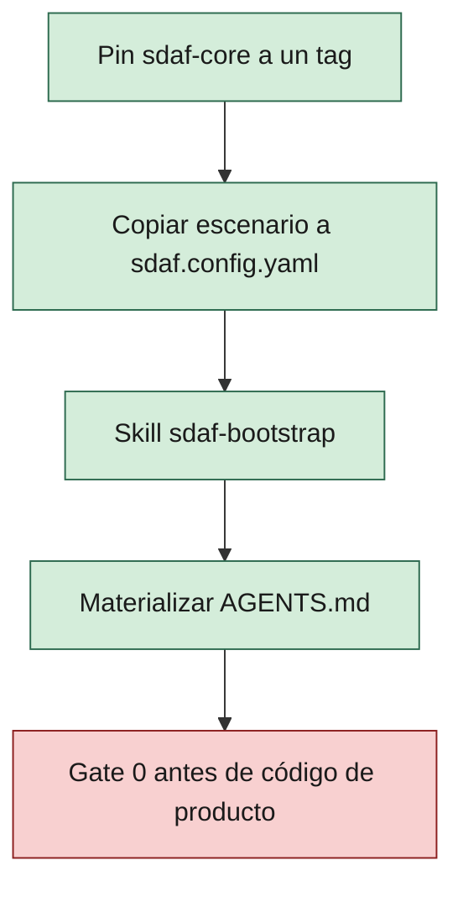

# Adopción y upgrade de sdaf-core

> [!NOTE]
> 🛠️ HOWTO operativo. No sustituye el [handbook](../handbook/README.md).
>
> **Adoptar** es pinnear este core, copiar un escenario de config y ejecutar bootstrap. **Upgrade** es mover el pin y alinear `sdaf.version`.

**En esta página:** [Versionado](#versionado) · [Adopción](#adopción-canónica) · [Upgrade](#upgrade) · [Migración 0.1→0.2](#migración-de-citas-handbook-01x-020) · [Pack](#pack-de-stack)

## Versionado

| Concepto | Uso |
|----------|-----|
| Tag Git `vX.Y.Z` | Release del árbol sdaf-core |
| `sdaf.version` en `sdaf.config.yaml` | Misma semver **mayor.menor** del core adoptado |
| Capítulos / skills | Alineados a la misma línea 0.2.x |

> [!TIP]
> El pin recomendado del árbol es `v0.2.1`. `sdaf.version` puede seguir `0.2.0` hasta que el consumidor actualice el YAML.

Subir de `0.1.x` a `0.2.0` es un upgrade consciente (breaking de citas de handbook).

## Adopción (canónica)



1. Añadir sdaf-core como **submodule** pinneado a un tag, p. ej. en `.sdaf/`:

```text
git submodule add -b main <url-sdaf-core> .sdaf
cd .sdaf && git checkout v0.2.1
```

2. Copiar un escenario de [`examples/`](../examples/README.md) a `sdaf.config.yaml` en la raíz del consumidor (`sdaf.version: "0.2.0"` es válido con pin `v0.2.1`).
3. Ejecutar la skill [`sdaf-bootstrap`](../skills/sdaf-bootstrap/SKILL.md) (o seguir sus pasos a mano).
4. Materializar `AGENTS.md` desde [`AGENTS.md.template`](../AGENTS.md.template).

### Alternativas

| Enfoque | Pros | Contras |
|---------|------|---------|
| Submodule (`.sdaf/`) | Pin claro, upgrade explícito | Curva git submodule |
| Subtree | Historia integrada | Merges de upgrade más ruidosos |
| Copia / template | Simple al inicio | Difícil propagar mejoras del core |

## Upgrade

Usar [`sdaf-upgrade`](../skills/sdaf-upgrade/SKILL.md). Checklist:

1. Actualizar pin del submodule/tag al nuevo `vX.Y.Z`.
2. Leer [`handbook/CHANGELOG.md`](../handbook/CHANGELOG.md).
3. Actualizar `sdaf.version`.
4. Regenerar `AGENTS.md` si cambió la plantilla.
5. Revisar citas `skill-id@version` en worklogs **nuevos**.
6. Si venías de 0.1.x: remapear citas de capítulos según la tabla siguiente.
7. No auto-migrar specs ni handbook de producto del consumidor.

## Migración de citas handbook (0.1.x → 0.2.0)

<details>
<summary>Tabla de remap 0.1.x → 0.2.0 (citas de capítulos)</summary>

| Antes | Después |
|-------|---------|
| `handbook/05-sdaf-framework.md` / H05 | `handbook/01-sdaf-framework.md` / H01 |
| `handbook/06-engineering-principles.md` / H06 | `handbook/02-engineering-principles.md` / H02 |
| `handbook/07-repository-organization.md` / H07 | `handbook/03-repository-organization.md` / H03 |
| `handbook/08-specification-standard.md` / H08 | `handbook/04-specification-standard.md` / H04 |
| `handbook/09-development-workflow.md` / H09 | `handbook/05-development-workflow.md` / H05 |
| `handbook/13-ai-agent-framework.md` / H13 | `handbook/06-ai-agent-framework.md` / H06 |
| `handbook/14-prompt-engineering-standard.md` / H14 | `handbook/07-prompt-engineering-standard.md` / H07 |
| `handbook/15-agent-traceability.md` / H15 | `handbook/08-agent-traceability.md` / H08 |
| `handbook/B-templates.md` | `handbook/A-templates.md` |

</details>

Partes: antigua “Parte II / IV” → **Parte I (método)** / **Parte II (IA)**.

## Pack de stack

Si `stack.pack` ≠ `null`, cumplir [`contrato-pack-stack.md`](contrato-pack-stack.md).

### Materialización en el consumidor

Preferir **symlinks relativos** (Git mode `120000`) de skills, agentes, prompts y reglas del core y del pack hacia la raíz del consumidor. En repos de referencia (p. ej. ShiftFlow-sdaf) hay un script documentado `scripts/materialize-submodules.ps1` + HOWTO `docs/materializacion-submodules.md`. Superficie Cursor opcional: `.cursor/skills/<id>` enlazada al submodule.

Copia literal solo como fallback documentado.

> [!WARNING]
> No usar junctions de Windows (`mklink /J`).

Parche **0.2.1** (hasta pin `v0.2.1`): contexto autorizado en contratos; recibo y línea de decisión en worklogs **nuevos**. Sin backfill. `sdaf.version` puede seguir `0.2.0`.

Parche **0.2.2** (docs): navegación, diagramas y vocabulario visual; no cambia la norma. No exige retag ni cambio de `sdaf.version`.

## Fuera de 0.2.x

Sin implementar en esta línea:

- Capítulos detallados de testing / devops / security / métricas de sprint en el handbook del método
- Glosario de dominio (pertenece al producto)
- `project.language` distinto de `es`
- CLI de materialización (las skills playbook bastan)

No se reintroducen huecos numéricos “por si acaso” en el handbook del core.

## Relacionado

| | Destino | Por qué |
|--|---------|---------|
| 🧭 | [mapa-navegacion.md](mapa-navegacion.md) | Ocho tareas y clics |
| 🛠️ | [skills/sdaf-bootstrap](../skills/sdaf-bootstrap/SKILL.md) | Pasos de árbol y config |
| 🛠️ | [skills/sdaf-upgrade](../skills/sdaf-upgrade/SKILL.md) | Mover el pin |
| 📖 | [handbook/CHANGELOG.md](../handbook/CHANGELOG.md) | Qué cambió en cada tag |
