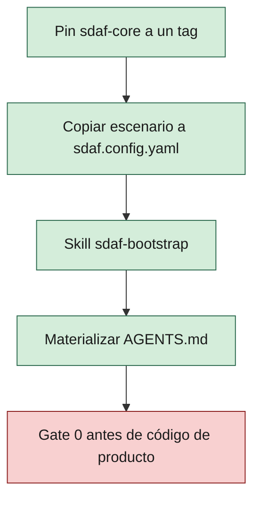

# Adopción y upgrade de sdaf-core

> [!NOTE]
> 🛠️ HOWTO operativo. No sustituye el [handbook](../handbook/README.md).
>
> **Adoptar** es pinnear este core, copiar un escenario de config y ejecutar bootstrap. **Upgrade** es mover el pin y alinear `sdaf.version`.

**En esta página:** [Versionado](#versionado) · [Adopción](#adopción-canónica) · [Upgrade](#upgrade) · [Migración 0.1→0.2](#migración-de-citas-handbook-01x-020) · [Pack](#pack-de-stack)

## Versionado

| Concepto | Uso |
|----------|-----|
| Tag Git `vX.Y.Z` | Pin del **árbol** sdaf-core. Tags publicados: `v0.1.0`, `v0.2.0`, `v0.2.1`, `v0.3.2`, `v0.3.3`, `v0.4.0`, `v0.4.1`. **No** existen `v0.3.0` ni `v0.3.1`. |
| `sdaf.version` en `sdaf.config.yaml` | Línea de **constitución** (semver **mayor.menor**). Con pin `v0.4.1` o `v0.4.0`, `"0.4.0"`; con pin `v0.3.3`, `"0.3.0"`. No es un tag. |
| Capítulos / skills | Alineados a la misma línea (`0.2.x`, `0.3.x` o `0.4.x` según pin) |

> [!TIP]
> El pin recomendado del árbol es `v0.4.1`. `sdaf.version` nombra la línea (`"0.4.0"` o `"0.3.0"`), no un tag: `v0.3.0` no existe. Quien se quede en `v0.3.3` o `v0.2.1` no está obligado.

Subir de `0.1.x` a `0.2.0` es un upgrade consciente (breaking de citas de handbook).

## Adopción (canónica)



1. Añadir sdaf-core como **submodule** pinneado a un tag, p. ej. en `.sdaf/`:

```text
git submodule add -b main <url-sdaf-core> .sdaf
cd .sdaf && git checkout v0.4.1
```

2. Copiar un escenario de [`examples/`](../examples/README.md) a `sdaf.config.yaml` en la raíz del consumidor (`sdaf.version` nombra la línea de constitución: `"0.4.0"` con pin `v0.4.1` o `v0.4.0`, `"0.3.0"` con pin `v0.3.3`).
3. Ejecutar la skill [`sdaf-bootstrap`](../skills/sdaf-bootstrap/SKILL.md) (o seguir sus pasos a mano).
4. Materializar `AGENTS.md` desde [`AGENTS.md.template`](../AGENTS.md.template).
5. Opcional: validar `sdaf.config.yaml` con la composite action [`.github/actions/validate-sdaf`](../.github/actions/validate-sdaf/README.md) (disponible desde `v0.4.0`).

### Alternativas

| Enfoque | Pros | Contras |
|---------|------|---------|
| Submodule (`.sdaf/`) | Pin claro, upgrade explícito | Curva git submodule |
| Subtree | Historia integrada | Merges de upgrade más ruidosos |
| Copia / template | Simple al inicio | Difícil propagar mejoras del core |

## Upgrade

Usar [`sdaf-upgrade`](../skills/sdaf-upgrade/SKILL.md). Checklist:

1. Actualizar pin del submodule/tag al nuevo `vX.Y.Z`.
2. Leer [`handbook/CHANGELOG.md`](../handbook/CHANGELOG.md).
3. Actualizar `sdaf.version`.
4. Regenerar `AGENTS.md` si cambió la plantilla.
5. Revisar citas `skill-id@version` en worklogs **nuevos**.
6. Si venías de 0.1.x: remapear citas de capítulos según la tabla siguiente.
7. No auto-migrar specs ni handbook de producto del consumidor.

## Migración de citas handbook (0.1.x → 0.2.0)

<details>
<summary>Tabla de remap 0.1.x → 0.2.0 (citas de capítulos)</summary>

| Antes | Después |
|-------|---------|
| `handbook/05-sdaf-framework.md` / H05 | `handbook/01-sdaf-framework.md` / H01 |
| `handbook/06-engineering-principles.md` / H06 | `handbook/02-engineering-principles.md` / H02 |
| `handbook/07-repository-organization.md` / H07 | `handbook/03-repository-organization.md` / H03 |
| `handbook/08-specification-standard.md` / H08 | `handbook/04-specification-standard.md` / H04 |
| `handbook/09-development-workflow.md` / H09 | `handbook/05-development-workflow.md` / H05 |
| `handbook/13-ai-agent-framework.md` / H13 | `handbook/06-ai-agent-framework.md` / H06 |
| `handbook/14-prompt-engineering-standard.md` / H14 | `handbook/07-prompt-engineering-standard.md` / H07 |
| `handbook/15-agent-traceability.md` / H15 | `handbook/08-agent-traceability.md` / H08 |
| `handbook/B-templates.md` | `handbook/A-templates.md` |

</details>

Partes: antigua “Parte II / IV” → **Parte I (método)** / **Parte II (IA)**.

## Pack de stack

Si `stack.pack` ≠ `null`, cumplir [`contrato-pack-stack.md`](contrato-pack-stack.md).

### Materialización en el consumidor

Preferir **symlinks relativos** (Git mode `120000`) de skills, agentes, prompts y reglas del core y del pack hacia la raíz del consumidor. En repos de referencia (p. ej. ShiftFlow-sdaf) hay un script documentado `scripts/materialize-submodules.ps1` + HOWTO `docs/materializacion-submodules.md`. Superficie Cursor opcional: `.cursor/skills/<id>` enlazada al submodule.

Copia literal solo como fallback documentado.

> [!WARNING]
> No usar junctions de Windows (`mklink /J`).

Parche **0.2.1** (hasta pin `v0.2.1`): contexto autorizado en contratos; recibo y línea de decisión en worklogs **nuevos**. Sin backfill. `sdaf.version` puede seguir `0.2.0`.

Parche **0.2.2** (docs): navegación, diagramas y vocabulario visual; no cambia la norma. No exige retag ni cambio de `sdaf.version`.

## 0.3.0 (opt-in)

Línea nueva de constitución. **No** rompe citas `H00`–`H08`. Quien se quede en `v0.2.1` no está obligado.

Al pinnear la línea 0.3 (tag `v0.3.3`; no hay tag `v0.3.0`):

1. Leer Parte III: [H09](../handbook/09-testing-framework.md)–[H12](../handbook/12-security-standards.md).
2. Adoptar QG-Sec y runbook local si no existían.
3. Materializar `SECURITY.md` desde [`templates/security.md`](../templates/security.md).
4. Opcional: ADR de coding standards para QG-Docs (pack o consumidor).
5. Actualizar `sdaf.version` a `0.3.0` y materializar skills nuevas (`testing-review-pr`, `security-review`, `devops-ci-gate`).

Métricas de sprint detalladas siguen en el handbook de **producto**, no en el core.

## 0.3.1 (parche)

Enmienda de [H06 §7](../handbook/06-ai-agent-framework.md#7-restricciones-globales): commit local y cualquier escritura al remoto (push, tags, releases, merge, PR, APIs, CI que escriba el repo) solo con petición humana explícita. La excepción en `AGENTS.md` o ADR debe enumerar qué permite.

No rompe citas. No exige cambiar `sdaf.version` si ya está en `0.3.0`.

## 0.3.2 (parche)

Ganchos de gobernanza **sin estatizar adopción**. Al pinnear un tag que incluya 0.3.2:

1. QG-Sec según [H12 §5.2](../handbook/12-security-standards.md#52-qg-sec) (no solo secreto y bypass de auth).
2. Merge a demo/integración: humano nominado ([H10](../handbook/10-code-review-and-quality-gates.md) QG-Review).
3. Worklogs **nuevos** de código de producto: origen de cambios ([H08 §4.3](../handbook/08-agent-traceability.md#43-origen-de-cambios)); sin backfill.
4. Overlays (SSDF, SBOM, AIMS, …): **N/A** hasta que el consumidor apruebe un ADR. No son bug por sí solos.

No rompe citas. `sdaf.version` puede seguir `0.3.0`.

## 0.3.3 (parche)

Enmienda de [H06 §7](../handbook/06-ai-agent-framework.md#7-restricciones-globales): **encargo vigente** = el mensaje de usuario de **este turno**. El historial de la conversación, un PR abierto o terminar archivos no autorizan commit ni escritura al remoto. Autoriza solo lo que este mensaje nombra.

Copia operativa para agentes Cursor: `.cursor/rules/git-remoto-encargo.mdc` (materializar junto a `idioma-castellano.mdc`).

No rompe citas. No exige cambiar `sdaf.version` si ya está en `0.3.0`.

## 0.4.0 (opt-in)

Línea nueva de constitución. **No** rompe citas `H00`–`H12`. Quien se quede en `v0.3.3` o `v0.2.1` no está obligado.

Al pinnear `v0.4.0`:

1. Leer [H13](../handbook/13-enmienda-excepciones-ciclo-de-vida.md): enmienda, excepciones con caducidad, derogación, breaking y mantenedor único.
2. QG-Review: «nominada» = la identidad de `CODEOWNERS` del consumidor ([H10](../handbook/10-code-review-and-quality-gates.md)).
3. Worklogs **nuevos** con el frontmatter de [`templates/worklog.md`](../templates/worklog.md) (`commit`, `pr`, `rama`, `sha` o `null`). Los worklogs en tabla siguen válidos; sin backfill.
4. Si algún script lee el historial del cuerpo de un capítulo, pasa a leer `handbook/_meta/<capítulo>.yaml`.
5. Opcional: composite action [`validate-sdaf`](../.github/actions/validate-sdaf/README.md) en el CI del consumidor.
6. Actualizar `sdaf.version` a `"0.4.0"`.

## 0.4.1 (parche)

[ADR-004](../architecture/decisions/ADR-004-tooling-externo-de-agentes.md): el tooling externo de agentes es **opcional**. Al pinnear `v0.4.1`:

1. Nada obligatorio: toda `sdaf.config.yaml` válida en `0.4.0` sigue validando.
2. Si el repo adopta gentle-ai, declararlo en `tooling.gentle_ai` (release o SHA de commit) y seguir [`integracion-gentle-ai.md`](integracion-gentle-ai.md).

No rompe citas. `sdaf.version` sigue en `"0.4.0"`.

## Fuera de 0.3.x

Sin implementar en esta línea:

- Métricas de sprint / capacidad humana detallada (producto)
- Glosario de dominio (pertenece al producto)
- `project.language` distinto de `es`
- CLI de materialización (las skills playbook bastan)

No se reintroducen huecos numéricos “por si acaso” en el handbook del core.

## Relacionado

| | Destino | Por qué |
|--|---------|---------|
| 🧭 | [mapa-navegacion.md](mapa-navegacion.md) | Ocho tareas y clics |
| 🛠️ | [skills/sdaf-bootstrap](../skills/sdaf-bootstrap/SKILL.md) | Pasos de árbol y config |
| 🛠️ | [skills/sdaf-upgrade](../skills/sdaf-upgrade/SKILL.md) | Mover el pin |
| 📖 | [handbook/CHANGELOG.md](../handbook/CHANGELOG.md) | Qué cambió en cada tag |
