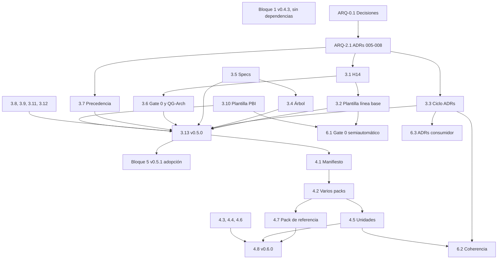

# Plan de iniciativa INIT-arquitectura — sdaf-core

| Campo | Valor |
|--------|--------|
| ID | INIT-arquitectura |
| Versión | 0.1.3 |
| Estado | Draft |
| Fecha | 2026-10-02T18:02+02:00 |
| Base | `v0.4.2` + `9c90c79` (`main`, 2026-09-27) |
| Responsable de aceptar | Manuel Ortiz de Villajos Quirós (@mortiz-iadev, CODEOWNERS) |
| ADRs propuestos | ADR-005, ADR-006, ADR-007, ADR-008 (estado Propuesto) |
| Worklogs | [Iteration-001](../../worklogs/INIT-arquitectura/Iteration-001.md), [Iteration-002](../../worklogs/INIT-arquitectura/Iteration-002.md), [Iteration-003](../../worklogs/INIT-arquitectura/Iteration-003.md), [Iteration-004](../../worklogs/INIT-arquitectura/Iteration-004.md), [Iteration-005](../../worklogs/INIT-arquitectura/Iteration-005.md) |

> [!NOTE]
> 🛠️ Plan de iniciativa: organiza trabajo sobre el core. **No** es constitución ni sustituye al [handbook](../../handbook/README.md) ni a los [ADRs](../../architecture/decisions/README.md).

**En esta página:** [Objetivo](#1-objetivo-y-alcance) · [Hallazgos](#2-hallazgos-de-partida) · [Decisiones](#3-decisiones-humanas-previas) · [Versiones](#4-estrategia-de-versiones) · [Backlog](#5-backlog-por-bloques) · [Cobertura](#6-cobertura) · [Dependencias](#7-dependencias) · [Validación](#8-validación) · [Riesgos](#9-riesgos) · [DoD](#10-definition-of-done-de-la-iniciativa) · [Siguiente paso](#11-siguiente-paso)

> [!NOTE]
> Este plan es un borrador de trabajo. Ningún PBI se ejecuta, ningún ADR se acepta y no se crea commit, rama remota, PR ni tag sin orden humana en el encargo vigente ([H06 §7](../../handbook/06-ai-agent-framework.md#7-restricciones-globales)).

---

## 1. Objetivo y alcance

**Objetivo.** Convertir la arquitectura en un artefacto gobernado del método, al mismo nivel que specs y worklogs, y cerrar el modelo de capas core → packs → overlay, sin estatizar el core a una adopción concreta.

**Dentro del alcance**

- Línea base arquitectónica del consumidor y su relación con Gate 0 y QG-Arch.
- Ciclo de vida de ADRs (sustitución, rechazo, vigencia).
- Atributos de calidad y contratos de integración en el estándar de specs.
- Trazabilidad spec/PBI → unidad arquitectónica y plantilla de PBI.
- Precedencia única entre handbook, línea base, ADRs, specs y packs.
- Modelo de capas: varios packs, manifiesto, colisiones, overlay, materialización.
- Topología con varias unidades de código.
- Adopción sobre código existente.
- Automatización semiautomática de Gate 0 y de coherencia arquitectónica.
- Coherencia de versiones en la documentación publicada.

**Fuera del alcance**

- Imponer estilo arquitectónico, notación (C4, arc42) o stack.
- Soporte de `project.language` distinto de `es` (se registra como decisión, D-8).
- Definir el rol «director técnico» (sigue abierto en H13 §8; afecta a quién aprueba, no a qué se aprueba).
- Cambios en repos consumidores más allá del piloto.

**Prueba de abstracción** (se aplica a cada PBI en review): ninguna norma nueva nombra un estilo, una notación, un stack ni un producto; todo lo concreto vive en ADRs del consumidor o en packs.

---

## 2. Hallazgos de partida

| ID | Hallazgo | Evidencia en `v0.4.2` |
|----|----------|-----------------------|
| H-1 | No existe línea base arquitectónica; G0.3 y QG-Arch no son auditables | H10 §3.2 y §4, H05 §3 G0.3, prompt `PROMPT-AGT-ARCH-001`, `templates/handbook-product.md` sin sección de arquitectura, `sdaf-bootstrap` no la crea |
| H-2 | Los ADRs registran decisiones pero no permiten calcular la arquitectura vigente | `templates/adr.md`; `check-adrs.py` fija Propuesto/Aceptado/Deprecado; sin «Sustituido por» ni Rechazado |
| H-3 | Los atributos de calidad no tienen contenido mínimo | H04 §3 cita NFRs; H04 §5 no los define |
| H-4 | Jerarquía y precedencia se contradicen; el pack no aparece | H01 §3 (Specs → ADR) frente a H01 §3.2 (ADR por encima de specs); ADR-004 sí da precedencia al tooling externo |
| H-5 | Modelo de capas incompleto | `stack.pack` escalar; contrato de pack sin rango de core, sin manifiesto ni regla de colisiones; materialización en un repo consumidor |
| H-6 | Topología de código plana | `stack.src_path` y `stack.tests_path` únicos; `check-worklog-presence.py` solo mira esas rutas |
| H-7 | Trazabilidad sin eslabón arquitectónico; backlog sin formato; Gate 0 manual | H08 §6; sin `templates/pbi.md`; tipos de spec sin contratos de integración; `validate-sdaf` solo valida config y presencia de worklog |
| H-8 | Sin camino para adoptar sobre código existente | H05 §3 y §8; ninguna mención en `docs/` |
| H-9 | Fugas de abstracción | H01 §4 «Calculation Rules»; contrato del Architecture Agent «dominio sin infra/UI»; `project.language` solo `es` sin ADR |
| H-10 | Incoherencias de versión en documentación | README (00–12, 0.3.3), H05 G2.3 («si pinnea 0.3»), H06 §3 («Por defecto en v0.2»), `sdaf.config.schema.*` y `examples/` («v0.3»), `skills/README.md` y `prompts/README.md` («Catálogo v0.3») |

---

## 3. Decisiones humanas previas

Bloquean los PBIs indicados. Recomendación en negrita; el humano decide. D-1 a D-9 están cerradas desde 2026-10-02 (la opción elegida es la recomendada); los ADR-005 a 008 siguen Propuestos hasta que un humano los acepte (ARQ-2.1).

| ID | Pregunta | Opciones | Recomendación | Bloquea |
|----|----------|----------|---------------|---------|
| D-1 | ¿Gate 0 exige la línea base? | A) Sí, en línea nueva opt-in `0.5.0`. B) Solo aviso en `0.4.x`. C) Recomendada sin gate. | **Cerrada: A** (2026-10-02T18:02+02:00, Manuel Ortiz de Villajos Quirós, CODEOWNERS; transcrita del chat, aceptando la recomendación del plan). Sin gate, G0.3 y QG-Arch siguen sin ser auditables; la línea opt-in no obliga a nadie en `0.4.x` | Bloque 3 |
| D-2 | ¿Dónde vive la línea base? | A) `architecture/description.md`. B) Carpeta `architecture/description/`. C) Sección del handbook de producto. | **Cerrada: A** (2026-10-02T18:02+02:00, Manuel Ortiz de Villajos Quirós, CODEOWNERS; transcrita del chat, aceptando la recomendación del plan), con B permitido si crece (índice en el fichero) | ARQ-3.1, 3.2, 3.4 |
| D-3 | Precedencia entre ADRs y specs | A) ADR > spec (actual). B) Spec > ADR. C) Mismo nivel por materia; conflicto = STOP y enmienda. | **Cerrada: C** (2026-10-02T18:02+02:00, Manuel Ortiz de Villajos Quirós, CODEOWNERS; transcrita del chat, aceptando la recomendación del plan; ADR-007 §2) | ARQ-3.7 |
| D-4 | Número del ADR de adopción | A) Reutilizar 008 con nota. B) Reservar 008 y cambiar `check-adrs.py`. | **Cerrada: A** (2026-10-02T18:02+02:00, Manuel Ortiz de Villajos Quirós, CODEOWNERS; transcrita del chat, aceptando la recomendación del plan). La cita histórica está acotada «hasta `v0.3.3`» y el README lo aclara | ARQ-2.1 |
| D-5 | ¿Dónde se versionan los planes de iniciativa del core? | A) Fuera del repo (precedente de la auditoría v0.3.3). B) `docs/iniciativas/`. C) Carpeta nueva `initiatives/` con su checker. | **Cerrada: B** (2026-09-29T07:28+02:00, Manuel Ortiz de Villajos Quirós, CODEOWNERS; transcrita, no autodeclarada) | ARQ-0.2 |
| D-6 | Varios packs en la config | A) `stack.packs` con `stack.pack` como alias obsoleto. B) Sustituir `stack.pack` (breaking). | **Cerrada: A** (2026-10-02T18:02+02:00, Manuel Ortiz de Villajos Quirós, CODEOWNERS; transcrita del chat, aceptando la recomendación del plan) | ARQ-4.2 |
| D-7 | ¿Quién declara la compatibilidad pack ↔ core? | A) El pack en su manifiesto. B) El consumidor en la config. | **Cerrada: A** (2026-10-02T18:02+02:00, Manuel Ortiz de Villajos Quirós, CODEOWNERS; transcrita del chat, aceptando la recomendación del plan). El autor del pack es quien la conoce | ARQ-4.1 |
| D-8 | Idioma `es` fijo | A) Mantener y registrarlo como decisión explícita. B) Abrir i18n. | **Cerrada: A** (2026-10-02T18:02+02:00, Manuel Ortiz de Villajos Quirós, CODEOWNERS; transcrita del chat, aceptando la recomendación del plan). Es una decisión deliberada; solo falta registrarla | ARQ-3.12 |
| D-9 | Capítulo nuevo o enmienda | A) H14 «Descripción de arquitectura». B) Ampliar H03 y H04. | **Cerrada: A** (2026-10-02T18:02+02:00, Manuel Ortiz de Villajos Quirós, CODEOWNERS; transcrita del chat, aceptando la recomendación del plan). Añadir capítulo no renumera ni rompe citas (H13 §5) | ARQ-3.1 |

---

## 4. Estrategia de versiones

| Release | Tipo | Contenido | Breaking | Depende de |
|---------|------|-----------|----------|------------|
| `v0.4.3` | Parche, clase redacción | Coherencia de versiones (bloque 1) | No | — |
| `v0.5.0` | Línea opt-in | Arquitectura como artefacto, ciclo de ADRs, precedencia, calidad, trazabilidad, PBI, fugas de abstracción (bloque 3) | Sí (G0.6) | D-1, D-2, D-3, D-9; ADR-005, 006 y 007 §2 Aceptados |
| `v0.5.1` | Parche de línea | Adopción sobre código existente (bloque 5) | No | ADR-008 Aceptado; `v0.5.0` |
| `v0.6.0` | Línea opt-in | Modelo de capas y topología (bloque 4) | Sí (contrato de pack y config) | D-6, D-7; ADR-007 Aceptado; release de `sdaf-stack-dotnet` con manifiesto |
| Transversal | En cada línea | Automatización (bloque 6) | No (opt-in en la action) | Plantillas de los bloques 3 y 4 |

Quien se quede en una línea anterior no está obligado (precedente de `0.3.0` y `0.4.0`).

---

## 5. Backlog por bloques

Formato de cada PBI: hallazgos · artefactos · clase de cambio · criterios de aceptación · dependencias.

### Bloque 0 — Decisiones y preparación

**ARQ-0.1 — Cerrar decisiones D-1 a D-9** (hecho en Iteration-005)
- Hallazgos: todos.
- Artefactos: este plan (sección 3), fila de decisión en el worklog.
- Aceptación: cada D-n con opción elegida, fecha con hora y zona, y quién decide.
- Depende de: —.

**ARQ-0.2 — Ubicar y versionar el plan** (hecho en Iteration-002)
- Artefactos: `docs/iniciativas/INIT-arquitectura.md`, `docs/iniciativas/README.md`, `docs/README.md`, `mkdocs/mkdocs.yml`.
- Aceptación: el plan está en `docs/iniciativas/`, enlazado desde el índice de HOWTO y la navegación de MkDocs; el worklog lo enlaza.
- Depende de: D-5.

### Bloque 1 — `v0.4.3`: coherencia de versiones

**ARQ-1.1 — README y handbook README** (hecho: v0.4.3)
- Hallazgos: H-10.
- Artefactos: `README.md` (tabla «Tres puertas»: 00–13 y línea 0.4.0).
- Clase: redacción.
- Aceptación: ninguna cifra de capítulos o línea contradice la tabla «Estado».

**ARQ-1.2 — Condición obsoleta en G2.3 y «v0.2» en H06 §3** (hecho: v0.4.3)
- Artefactos: `handbook/05-development-workflow.md`, `handbook/06-ai-agent-framework.md`, sus `_meta/*.yaml`.
- Clase: redacción (bump patch de capítulo, fila de historial «sin cambio de norma»).
- Aceptación: `check-version-metadata.py` y `check-history-append-only.py` en verde.

**ARQ-1.3 — Etiquetas «v0.3» en config, ejemplos y catálogos** (hecho: v0.4.3)
- Artefactos: `sdaf.config.schema.yaml`, `sdaf.config.schema.json` (description), `sdaf.config.example.yaml` (pin recomendado), `examples/README.md`, `examples/01-default-core.yaml`, `examples/08-completo.yaml`, `skills/README.md`, `prompts/README.md`.
- Clase: redacción.
- Aceptación: las etiquetas nombran la línea vigente o son neutras («línea vigente»); `validate-examples.py` en verde.

**ARQ-1.4 — Release `v0.4.3`** (hecho: tag sobre `6ea4d63`, PR #33 y #34, worklog Iteration-004)
- Artefactos: `handbook/CHANGELOG.md`, `CHANGELOG.md`, `README.md` (contenido, tabla «Estado» y fila de tag), `docs/adopcion-y-upgrade.md` (sección 0.4.3), `.github/actions/validate-sdaf/README.md` (en el PR de publicación).
- Aceptación: CHANGELOG «no rompe citas»; `sdaf.version` sigue en `"0.4.0"`; tag por orden humana.
- Depende de: ARQ-1.1 a 1.3.

### Bloque 2 — Decisiones de arquitectura

**ARQ-2.1 — Revisar y aceptar ADR-005 a 008**
- Artefactos: `architecture/decisions/ADR-005` a `ADR-008`, índice `README.md`.
- Aceptación: cada ADR pasa a Aceptado o Rechazado por humano, con fila Aceptación; `check-adrs.py` en verde. ADR-007 puede aceptarse en dos tiempos (§2 para `0.5.0`, resto para `0.6.0`) o dividirse en dos ADRs.
- Depende de: ARQ-0.1.

### Bloque 3 — `v0.5.0`: arquitectura como artefacto

**ARQ-3.1 — Capítulo H14 «Descripción de arquitectura»**
- Hallazgos: H-1, H-3.
- Artefactos: `handbook/14-architecture-description.md`, `handbook/_meta/14-architecture-description.yaml`, `handbook/index.yaml`, `handbook/README.md`, `mkdocs/mkdocs.yml`.
- Contenido: propósito, contenido mínimo (ADR-005 §2), relación con ADRs y specs, estados, cuándo cambia, G0.6, prueba de abstracción.
- Clase: capítulo nuevo (no renumera).
- Aceptación: Draft → Approved por humano; `extract-handbook-meta.py`, `check-local-links.py --strict-anchors --strict-orphans` y `measure-handbook-scaffolding.py` en verde.
- Depende de: ARQ-2.1 (ADR-005), D-2, D-9.

**ARQ-3.2 — Plantilla de línea base**
- Hallazgos: H-1.
- Artefactos: `templates/architecture-description.md`, `handbook/A-templates.md`.
- Aceptación: siete secciones de ADR-005 §2, cada una con ejemplo neutral y la opción `N/A: <motivo>`; ninguna nombra estilo, notación ni stack.
- Depende de: ARQ-3.1.

**ARQ-3.3 — Ciclo de vida de ADRs**
- Hallazgos: H-2.
- Artefactos: `templates/adr.md`, `scripts/check-adrs.py`, fixtures en `scripts/testdata/`, test nuevo `scripts/test-adrs.py`, `.github/workflows/validate.yml`, `architecture/decisions/README.md` (columna de sustitución).
- Aceptación: estados de ADR-006 §1; reciprocidad de «Sustituye / Sustituido por»; «Caducidad» obligatoria en ADRs de excepción; fixtures de caso válido e inválido; ADR-001 a 008 siguen en verde.
- Depende de: ARQ-2.1 (ADR-006).

**ARQ-3.4 — Árbol del consumidor**
- Hallazgos: H-1, H-7.
- Artefactos: `handbook/03-repository-organization.md` (§2 árbol y §3 tabla): `architecture/description.md` y, si se crea el tipo, `specs/integration/`.
- Clase: significado (bump minor de capítulo).
- Depende de: D-2, ARQ-3.5.

**ARQ-3.5 — Estándar de specs: calidad, integración y unidades**
- Hallazgos: H-3, H-7.
- Artefactos: `handbook/04-specification-standard.md`, `templates/spec.md`.
- Cambios: §5.5 atributos de calidad con escenario medible (fuente, estímulo, entorno, respuesta, medida); tipo de spec de integración (contratos entre unidades o con terceros); campo de cabecera «Unidades»; campo «Origen» preparado para ADR-008.
- Clase: significado (bump minor).
- Aceptación: cada campo nuevo tiene ejemplo en la plantilla; H04 §8 enlaza la línea base.

**ARQ-3.6 — Gate 0 y QG-Arch contra la línea base**
- Hallazgos: H-1, H-7.
- Artefactos: `handbook/05-development-workflow.md` (G0.3 redefinido, G0.6 nuevo), `handbook/10-code-review-and-quality-gates.md` (§3.2 y QG-Arch), `skills/sdaf-gate0/SKILL.md`, `skills/testing-review-pr/SKILL.md`, `prompts/review/architecture-review.md`.
- Clase: significado incompatible (motivo de la línea `0.5.0`).
- Aceptación: «toca límites» se define con la lista de ADR-005 §4; QG-Arch `N/A` solo con motivo; las skills citan la nueva versión.
- Depende de: ARQ-3.1, D-1.

**ARQ-3.7 — Jerarquía y precedencia únicas**
- Hallazgos: H-4.
- Artefactos: `handbook/01-sdaf-framework.md` (§3 diagrama y §3.2), `handbook/README.md`, `AGENTS.md.template`.
- Aceptación: diagrama, flujo de H05 y lista de prioridad dicen lo mismo; aparecen línea base y packs; el conflicto spec ↔ ADR se resuelve según D-3.
- Depende de: D-3, ARQ-2.1 (ADR-007 §2).

**ARQ-3.8 — Pipeline de dominio neutral**
- Hallazgos: H-9.
- Artefactos: `handbook/01-sdaf-framework.md` §4.
- Cambio: «Calculation Rules» pasa a paso opcional («reglas derivadas, si el dominio las tiene») o desaparece; se añade el eslabón de arquitectura entre casos de uso e implementación.
- Clase: significado (bump minor).

**ARQ-3.9 — Architecture Agent y skill de ADR**
- Hallazgos: H-1, H-2, H-9.
- Artefactos: `agents/architecture-agent.md`, `prompts/agents/architecture-agent.md`, `prompts/system/master-architect.md`, `skills/adr-propose/SKILL.md`.
- Cambios: salidas = ADRs + línea base; checklist mantiene el índice de decisiones vigentes; se retira «dominio sin infra/UI» como norma y se sustituye por «reglas de dependencia de la línea base»; `adr-propose` aplica los estados de ADR-006.
- Aceptación: versiones y filas de historial nuevas; `check-version-metadata.py` en verde.

**ARQ-3.10 — Plantilla de PBI**
- Hallazgos: H-7.
- Artefactos: `templates/pbi.md`, `handbook/05-development-workflow.md` (G0.4), `skills/spec-draft-pbi/SKILL.md`, `prompts/planning/backlog-refinement.md`.
- Campos: ID, título, specs (IDs), acceptance, unidades, ADRs, estado, worklogs.
- Aceptación: G0.4 comprobable sin interpretación.

**ARQ-3.11 — Bootstrap y handbook de producto**
- Hallazgos: H-1.
- Artefactos: `skills/sdaf-bootstrap/SKILL.md` (crea línea base Draft), `templates/handbook-product.md` (enlace a la línea base), `docs/mapa-navegacion.md`.
- Aceptación: tras bootstrap en un repo vacío, Gate 0 hace STOP por specs y por línea base, y lo dice.

**ARQ-3.12 — Registrar el idioma fijo**
- Hallazgos: H-9.
- Artefactos: según D-8 (nota en `sdaf.config.schema.yaml` y ADR del core si se decide registrarlo).
- Aceptación: la restricción `es` tiene una decisión citable.

**ARQ-3.13 — Release `v0.5.0`**
- Artefactos: `handbook/CHANGELOG.md`, `README.md`, `docs/adopcion-y-upgrade.md` (sección 0.5.0 con migración: construir la línea base desde los ADRs vigentes), `skills/sdaf-upgrade/SKILL.md`, `sdaf.config.example.yaml`, `examples/`.
- Aceptación: todos los checks de `validate.yml` en verde; `mkdocs build --strict` en verde; piloto (sección 8) sin bloqueos; tag por orden humana.
- Depende de: ARQ-3.1 a 3.12.

### Bloque 4 — `v0.6.0`: modelo de capas y topología

**ARQ-4.1 — Manifiesto de pack**
- Hallazgos: H-5.
- Artefactos: `docs/contrato-pack-stack.md`, `sdaf-pack.schema.json` (nuevo), `templates/sdaf-pack.yaml` (nuevo).
- Aceptación: campos `id`, `version`, `core`, `provides`, `requires`; schema con casos válido e inválido.
- Depende de: D-7, ADR-007.

**ARQ-4.2 — Varios packs en la config**
- Hallazgos: H-5.
- Artefactos: `sdaf.config.schema.yaml` y `.json` (`stack.packs`, alias `stack.pack`), `scripts/validate-config.py`, `scripts/test-validate-config.py`, `scripts/testdata/`.
- Aceptación: rango `core` comprobado contra `sdaf.version`; colisión de ids entre packs = error; I4 recalculado con todos los packs; configs de `0.5.x` siguen validando con aviso de alias.
- Depende de: ARQ-4.1, D-6.

**ARQ-4.3 — Overlay y resolución por id**
- Hallazgos: H-4, H-5.
- Artefactos: `handbook/01-sdaf-framework.md` (capas), `docs/contrato-pack-stack.md`, `AGENTS.md.template`, `sdaf.config.schema.*` (sustitución explícita de ids de extensión).
- Aceptación: reglas de ADR-007 §5 escritas en un solo sitio y citadas desde los demás.

**ARQ-4.4 — Materialización en el core**
- Hallazgos: H-5.
- Artefactos: `docs/materializacion.md` (nuevo), `scripts/materialize.py` (nuevo, multiplataforma), test con fixture de core + dos packs + overlay; `docs/adopcion-y-upgrade.md` deja de remitir a un consumidor.
- Aceptación: materializa en Linux y Windows sin junctions; marca el origen en las copias de fallback; detecta colisiones antes de escribir.

**ARQ-4.5 — Unidades de código**
- Hallazgos: H-6.
- Artefactos: `sdaf.config.schema.*` (`stack.units`), `scripts/check-worklog-presence.py`, `skills/sdaf-gate0/SKILL.md`, `skills/sdaf-bootstrap/SKILL.md`.
- Aceptación: un cambio en cualquier unidad exige worklog; `src_path`/`tests_path` siguen funcionando como una unidad; los nombres de unidad coinciden con la línea base (comprobado en ARQ-6.2).
- Depende de: ARQ-4.2.

**ARQ-4.6 — Escenarios y documentación**
- Artefactos: `examples/09-varios-packs.yaml`, `examples/10-varias-unidades.yaml`, `examples/README.md`, `scripts/validate-examples.py`.

**ARQ-4.7 — Coordinación con el pack de referencia**
- Artefactos externos: release de `sdaf-stack-dotnet` con `sdaf-pack.yaml`.
- Aceptación: el pack declara `core` compatible con `0.6.x`; el core actualiza la referencia en `docs/contrato-pack-stack.md`.
- Depende de: ARQ-4.2.

**ARQ-4.8 — Release `v0.6.0`**
- Aceptación: como ARQ-3.13, con piloto sobre el overlay existente.

### Bloque 5 — `v0.5.1`: adopción sobre código existente

**ARQ-5.1 — Excepción de adopción**
- Hallazgos: H-8.
- Artefactos: `handbook/05-development-workflow.md` (nota junto a la excepción de spike), `handbook/13-enmienda-excepciones-ciclo-de-vida.md` §3 (tipo de excepción).
- Clase: significado sin romper gates.

**ARQ-5.2 — Specs de caracterización y ADRs de reconocimiento**
- Artefactos: `handbook/04-specification-standard.md` (valor `caracterización` en «Origen»), `templates/spec.md`, `templates/adr.md` (marca «decisión heredada»).

**ARQ-5.3 — Skill `sdaf-adopt-existing`**
- Artefactos: `skills/sdaf-adopt-existing/SKILL.md`, `skills/README.md`, `AGENTS.md.template`, `docs/adopcion-y-upgrade.md` (sección «Adoptar sobre un repo con código»).
- Aceptación: recorrido completo en un repo de prueba con código previo, sin violar Gate 0 en el perímetro gobernado.

### Bloque 6 — Automatización (transversal)

**ARQ-6.1 — Gate 0 semiautomático**
- Hallazgos: H-7.
- Artefactos: `scripts/check-gate0.py`, input `check-gate0` en `.github/actions/validate-sdaf/action.yml`, fixtures.
- Comprueba: el PBI existe con la plantilla de ARQ-3.10; las specs enlazadas existen y están Approved; hay acceptance; hay worklog; línea base Approved (G0.6).
- No comprueba: si hace falta ADR (G0.3 sigue siendo juicio, ahora contra la línea base).
- Depende de: ARQ-3.10, ARQ-3.2.

**ARQ-6.2 — Coherencia arquitectónica**
- Artefactos: `scripts/check-architecture.py`, input en la action.
- Comprueba: la línea base lista todos los ADRs vigentes y ningún sustituido; las unidades de `stack.units` existen en la línea base; las specs citan unidades existentes.
- Depende de: ARQ-3.3, ARQ-4.5.

**ARQ-6.3 — ADRs del consumidor**
- Artefactos: `check-adrs.py --root` expuesto en la action (input `check-adrs`).
- Depende de: ARQ-3.3.

---

## 6. Cobertura

| Hallazgo | PBIs |
|----------|------|
| H-1 | 2.1, 3.1, 3.2, 3.4, 3.6, 3.9, 3.11 |
| H-2 | 2.1, 3.3, 3.9, 6.3 |
| H-3 | 3.1, 3.5 |
| H-4 | 3.7, 4.3 |
| H-5 | 4.1, 4.2, 4.3, 4.4, 4.7 |
| H-6 | 4.5, 4.6 |
| H-7 | 3.4, 3.5, 3.6, 3.10, 6.1, 6.2 |
| H-8 | 5.1, 5.2, 5.3 |
| H-9 | 3.8, 3.9, 3.12 |
| H-10 | 1.1, 1.2, 1.3, 1.4 |

---

## 7. Dependencias

Las decisiones D-n se agrupan en ARQ-0.1. El bloque 1 no depende de ninguna.

Camino crítico: ARQ-0.1 → ARQ-2.1 → ARQ-3.1 → ARQ-3.6 → ARQ-3.13.

---

## 8. Validación

| Nivel | Qué | Cuándo |
|-------|-----|--------|
| CI del core | Todos los pasos de `.github/workflows/validate.yml` y `mkdocs build --strict` | Cada PR |
| Fixtures | Casos válido e inválido para cada checker nuevo o cambiado | Cada PR que toque `scripts/` |
| Prueba de abstracción | Revisión humana: ninguna norma nueva nombra estilo, notación, stack ni producto | QG-Review de cada PR de norma |
| Piloto | Aplicar la línea en un consumidor real (el overlay existente) en rama local, sin publicar | Antes de cada tag de línea |
| Repo sintético | Repo vacío y repo con código previo para `sdaf-bootstrap` y `sdaf-adopt-existing` | ARQ-3.11, ARQ-5.3 |

El piloto es evidencia externa: sus hallazgos entran al core como cambios genéricos, nunca como referencias a ese producto.

---

## 9. Riesgos

| Riesgo | Efecto | Mitigación |
|--------|--------|------------|
| Ceremonia excesiva (contra H02 §1, simplicidad primero) | La línea base se vuelve un documento que nadie mantiene | Mínimo de una página; secciones `N/A`; solo cambia cuando cambia una unidad, regla, integración o atributo priorizado |
| Estatizar el core | Pierde generalidad | Prueba de abstracción en cada review; ejemplos neutros en plantillas |
| Fatiga de líneas breaking (`0.5.0` y `0.6.0` seguidas) | Consumidores se quedan atrás | Líneas opt-in; migración escrita; posibilidad de fusionar ambas líneas si el calendario lo permite |
| Dependencia de un repo externo (pack) | Bloquea `v0.6.0` | Manifiesto ausente = aviso durante `0.6.x`; ARQ-4.7 fuera del camino crítico de `0.5.0` |
| Un solo mantenedor | Cuello de botella en aceptaciones | Agrupar aceptaciones por bloque; ADRs pequeños |
| Colisión de numeración ADR-008 | Citas ambiguas | D-4 y nota en el índice |

---

## 10. Definition of Done de la iniciativa

- [x] D-1 a D-9 cerradas y registradas (Iteration-005).
- [ ] ADR-005 a 008 Aceptados o Rechazados por humano.
- [ ] `v0.4.3`, `v0.5.0`, `v0.5.1` y `v0.6.0` publicadas o descartadas explícitamente.
- [ ] Cada hallazgo H-1 a H-10 cerrado por al menos un PBI hecho (sección 6).
- [ ] Piloto sin bloqueos en cada línea.
- [ ] Worklog por iteración con cambios materiales de handbook o ADR ([H08 §5](../../handbook/08-agent-traceability.md#5-cuándo-crear-worklog)).

---

## 11. Siguiente paso

1. Revisión humana de ADR-005 a 008 y su aceptación o rechazo (ARQ-2.1), empezando por ADR-005, ADR-006 y ADR-007 §2, que desbloquean `v0.5.0`.
2. Elegir la estrategia de entrega de `v0.5.0` (cadena sobre rama de feature recomendada) antes del primer commit del bloque 3.
3. Bloque 3 (`v0.5.0`) tras ARQ-2.1. El bloque 1 (`v0.4.3`) ya está publicado.

---

## Relacionado

| | Destino | Por qué |
|--|---------|---------|
| 📖 | [ADRs del core](../../architecture/decisions/README.md) | ADR-005 a 008, propuestos por esta iniciativa |
| 📖 | [H13](../../handbook/13-enmienda-excepciones-ciclo-de-vida.md) | Enmienda, breaking y bump |
| 🛠️ | [adopcion-y-upgrade.md](../adopcion-y-upgrade.md) | Dónde se documentará cada línea nueva |
| 🧭 | [Iniciativas](README.md) | Índice de planes de iniciativa |

## Historial

| Versión | Fecha | Cambio |
|---------|--------|--------|
| 0.1.3 | 2026-10-02T18:02+02:00 | D-1 a D-9 cerradas con la opción recomendada (ARQ-0.1); ARQ-1.1 a 1.4 hechos (`v0.4.3`); ARQ-1.4 completa sus artefactos; siguiente paso actualizado |
| 0.1.2 | 2026-09-29T07:50+02:00 | Diagrama de dependencias alineado con el texto (bloque 1 sin dependencias; 3.5, 3.8–3.12, 4.3, 4.4, 4.6 y 6.1–6.2 completos); ARQ-4.5 y 4.7 declaran su dependencia; `v0.5.1` es parche |
| 0.1.1 | 2026-09-29T07:28+02:00 | D-5 cerrada (B): el plan pasa a `docs/iniciativas/`; TOC y Relacionado |
| 0.1.0 | 2026-09-28T18:08+02:00 | Borrador inicial fuera del repo |
