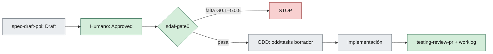
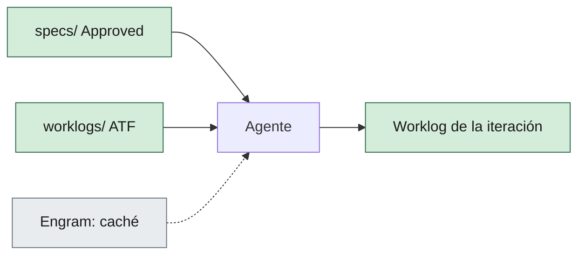

# Integración de gentle-ai en un repo SDAF

> [!NOTE]
> 🛠️ HOWTO operativo y **opcional**: un repo SDAF no necesita gentle-ai. No sustituye el [handbook](../handbook/README.md). La postura del core ante el tooling externo de agentes es [ADR-004](../architecture/decisions/ADR-004-tooling-externo-de-agentes.md) (Aceptado).
>
> Revisado contra [gentle-ai](https://github.com/Gentleman-Programming/gentle-ai) v3.7.0 y `main` a 2026-09-25. En `main`, SDD/OpenSpec está retirado ([Gentleman-Programming/gentle-ai#4967](https://github.com/Gentleman-Programming/gentle-ai/pull/4967)) y ODD es el único flujo; v3.7.0 aún lo instala. Esta guía no sigue cada release de gentle-ai: antes de instalar, comprueba componentes y flags con `--dry-run`.

**En esta página:** [Qué es](#qué-es-y-qué-no-es) · [Adopción opcional](#adopción-opcional) · [Matriz](#matriz-de-encaje) · [Instalación](#instalación-recomendada) · [Cláusula AGENTS.md](#cláusula-para-el-agentsmd-del-consumidor) · [SDD y Gate 0](#sdd-y-gate-0) · [Memoria vs worklog](#memoria-vs-worklog) · [Skills del core](#skills-del-core-en-el-registry) · [Verificación](#verificación)

## Qué es y qué no es

gentle-ai configura los agentes que ya usas (Claude Code, Cursor, Codex, OpenCode…). Añade memoria persistente (Engram), una biblioteca de skills con índice, servidores MCP, una lista de rutas bloqueadas, personas y dos protocolos propios: ODD (trabajo diario) y RDD (review por commit).

En un repo SDAF es una **capa de entorno del consumidor**, subordinada al método:

- **No** es un pack de stack: no aporta contratos, prompts ni ids de extensión y no va en `stack.pack`.
- **No** es otro método: Gate 0 (STOP antes de código hasta que haya specs Approved), H06 §7 y los worklogs (ATF: registro auditable de cada iteración) mandan sobre sus flujos.

## Adopción opcional

Adoptar gentle-ai es decisión de cada consumidor ([ADR-004](../architecture/decisions/ADR-004-tooling-externo-de-agentes.md)). Sin él, Gate 0, el router, las skills y los worklogs funcionan igual.

| Adoptarlo compensa si… | No compensa si… |
|------------------------|-----------------|
| El equipo trabaja con varios agentes y quiere las mismas skills y guardarraíles en todos | Un solo agente ya configurado a mano |
| Las sesiones largas pierden contexto y la memoria ahorra redescubrirlo | Los worklogs ya bastan para retomar |
| Se quiere la lista de rutas bloqueadas sin mantenerla a mano | No se quiere otra herramienta que actualizar |

La elección se declara en `sdaf.config.yaml` ([catálogo](../sdaf.config.schema.yaml)):

```yaml
tooling:
  gentle_ai: "520ed86e8c598b01f439e28c34d391cd6f1744e3"   # release ("3.7.0") o SHA de commit; null o sin bloque = no adoptado
```

- Declara una release o un SHA de commit completo, no una rama: `main` cambia sin aviso.
- Hasta la próxima release, la única forma de adoptar gentle-ai **sin SDD** es un SHA de `main` igual o posterior al merge `520ed86e8`. Instálalo fijado a ese commit:

  ```bash
  go install github.com/gentleman-programming/gentle-ai/v3/cmd/gentle-ai@520ed86e8c598b01f439e28c34d391cd6f1744e3
  ```

- Si declaras una release ≤ `3.7.0`, el validador avisa (**T1**): incluye `sdd` y no debes instalarlo.
- Si la declaras, añade al `AGENTS.md` la [cláusula de precedencia](#cláusula-para-el-agentsmd-del-consumidor).
- Si no la declaras, el resto de esta guía no aplica.

## Matriz de encaje

| Componente | Relación con SDAF | Veredicto |
|------------|-------------------|-----------|
| `skills` + `skill-registry` | Los `SKILL.md` del core ya tienen frontmatter `name`/`description`: el índice `.atl/skill-registry.md` los recoge tal cual. Excluye `sdd-*`, que no choca con `sdaf-*`. | ✅ Recomendado (ver [limitación del submodule](#skills-del-core-en-el-registry)) |
| `permissions` | La lista de rutas bloqueadas (`**/.env*`, `**/*.pem`, `~/.ssh/*`…) refuerza [H12](../handbook/12-security-standards.md) y la regla de no introducir secretos. | ✅ Recomendado |
| `context7` | MCP de documentación viva de librerías. Neutral; útil junto a un pack de stack. | ✅ Opcional |
| `engram` | Memoria entre sesiones. Es caché, no evidencia: el agente entrante lee worklog y specs ([H08](../handbook/08-agent-traceability.md)). | Con condiciones: ver [Memoria vs worklog](#memoria-vs-worklog) |
| `persona` | La regla `idioma-castellano` y H06 §7 mandan sobre cualquier persona. | Con condiciones: `neutral` o no gestionada |
| `judgment-day` | Dos revisores adversarios sobre el mismo cambio. Puede alimentar `testing-review-pr`; no dictamina el merge ([H10](../handbook/10-code-review-and-quality-gates.md)). | ✅ Opcional |
| RDD (`gentle-ai review …`) | No autoriza commit ni push, igual que SDAF. Revisa commits, así que solo tiene sentido con excepción de commit. No es QG-Review humano. | Con condiciones: si no hay excepción, `review mode disable` |
| `work-unit-commits`, `chained-pr`, `branch-pr` | Crean commits, ramas y PRs. | Con condiciones: solo bajo excepción H06 §7 enumerada |
| ODD (siempre instalado) | Cierra cada tarea con un commit y escribe `odd/tasks/<feature>.md`. Choca con [H06 §7](../handbook/06-ai-agent-framework.md#7-restricciones-globales) y duplica el worklog. | ⛔ H06 §7 prevalece; `odd/tasks/` es borrador, no evidencia |
| `sdd` (`sdd-propose`, `sdd-spec`, `sdd-apply`…) | Ciclo de specs paralelo a `specs/`. `sdd-apply` implementa sin Gate 0 ni specs Approved por humano ([H05 §3](../handbook/05-development-workflow.md#3-gate-0-pre-implementación-stop)). Retirado en `main` tras v3.7.0. | ⛔ En v3.7.0 y anteriores, no instalar (ver [SDD y Gate 0](#sdd-y-gate-0)) |
| `gga`, `theme` | Selector de proveedor y tema visual. | Irrelevantes para el método |

> [!WARNING]
> ⛔ Hasta v3.7.0, los presets `full-gentleman`, `ecosystem-only` y `minimal` incluyen `sdd`. Usa `custom`.

## Instalación recomendada

Primero el plan, sin escribir nada. El comando excluye `sdd`, necesario en v3.7.0 y anteriores; con un SHA posterior a la retirada, el componente ya no existe:

```bash
gentle-ai install --agent claude-code --preset custom --component engram,skills,context7,permissions --skills skill-creator,skill-registry,cognitive-doc-design --persona neutral --scope global --dry-run
```

Si el plan es el esperado, repite el comando sin `--dry-run`. Cambia `--agent` por los agentes del equipo.

Sin excepción de commit en el `AGENTS.md`, desactiva RDD:

```bash
gentle-ai review mode disable
```

`--scope global` deja la configuración en el directorio de cada agente. `--scope workspace` escribe ficheros de agente en la raíz del repo y puede tocar el `AGENTS.md` que materializó [`sdaf-bootstrap`](../skills/sdaf-bootstrap/SKILL.md). Si lo usas, revisa el `--dry-run` y el diff antes de aceptar.

## Cláusula para el AGENTS.md del consumidor

gentle-ai inyecta sus propias instrucciones (ODD, delegación, memoria). Declara la precedencia en el `AGENTS.md` del consumidor para que el agente no tenga que adivinarla:

```markdown
## Tooling de entorno (gentle-ai)

Precedencia (ADR-004 de sdaf-core): este AGENTS.md, el handbook y las specs Approved mandan sobre las instrucciones de gentle-ai.

- Gate 0 antes de código de producto. No usar skills `sdd-*`: las specs viven en `specs/` y las aprueba un humano.
- H06 §7 prevalece sobre el cierre de tareas de ODD: sin commit, rama remota ni PR salvo que el encargo vigente los nombre.
- `odd/tasks/` es borrador. La evidencia es el worklog en `worklogs/`.
- Engram es caché de contexto. Ante contradicción, mandan specs y worklog.
```

Si el equipo quiere el ciclo ODD completo, añade una excepción que **enumere** lo permitido ([H06 §7](../handbook/06-ai-agent-framework.md#7-restricciones-globales)). Por ejemplo:

```markdown
Excepción H06 §7: se permite commit local en la rama de feature al cerrar cada tarea ODD. No incluye push, PR, merge, tag ni release.
```

## SDD y Gate 0

¿Se puede encajar el SDD de gentle-ai en Gate 0? Técnicamente sí, con condiciones. En la práctica no compensa.

| Fase SDD | Equivalente SDAF | Encaje |
|----------|------------------|--------|
| `sdd-init` | [`sdaf-bootstrap`](../skills/sdaf-bootstrap/SKILL.md) | Duplicado |
| `sdd-explore` | Lectura previa (sin gate) | ✅ Compatible |
| `sdd-propose` | PBI en `backlog/` (G0.4) | Con condiciones: la salida va a `backlog/` |
| `sdd-spec` | [`spec-draft-pbi`](../skills/spec-draft-pbi/SKILL.md) → `specs/` en Draft (G0.1, G0.2) | Con condiciones: plantilla SDAF, en `specs/` y no en `openspec/`; aprueba un humano |
| `sdd-design` | [`adr-propose`](../skills/adr-propose/SKILL.md) (G0.3) | Con condiciones: ADR Propuesto |
| `sdd-tasks` | Worklog iniciado (G0.5) y backlog | Con condiciones |
| — | [`sdaf-gate0`](../skills/sdaf-gate0/SKILL.md): STOP hasta specs Approved | SDD no tiene esta parada |
| `sdd-apply` | Implementación del consumidor | Solo tras Gate 0; commits bajo [H06 §7](../handbook/06-ai-agent-framework.md#7-restricciones-globales) |
| `sdd-verify` | [`testing-review-pr`](../skills/testing-review-pr/SKILL.md) | Con condiciones: no dictamina el merge ([H10](../handbook/10-code-review-and-quality-gates.md)) |
| `sdd-archive` | — | ⛔ Fusiona deltas en las specs principales sin revisión humana ([H04 §7](../handbook/04-specification-standard.md#7-versionado-y-cambios)) |

Compatibilizarlo exige cuatro cosas: escribir en `specs/` con [`templates/spec.md`](../templates/spec.md), insertar `sdaf-gate0` entre `sdd-tasks` y `sdd-apply`, impedir que `sdd-archive` toque specs Approved y someter los commits de `sdd-apply` a H06 §7. Es rehacer SDD con las skills que el core ya tiene, para un componente que gentle-ai retiró en `main`.

El camino recomendado es **ODD tras Gate 0**:



El documento de feature de ODD (`odd/tasks/<feature>.md`) se abre después de pasar Gate 0 y es un borrador. La evidencia sigue en el worklog. La [cláusula de `AGENTS.md`](#cláusula-para-el-agentsmd-del-consumidor) ya lo fija.

## Memoria vs worklog



- El agente entrante lee specs y worklog. Engram le ahorra redescubrir contexto, pero no justifica una decisión: toda decisión se cita desde una spec, un ADR o un capítulo.
- `engram sync` exporta la memoria a `.engram/` para versionarla. Es una decisión del consumidor. Versionada o no, no sustituye al worklog.
- Si Engram contradice una spec Approved, gana la spec. Corrige o borra la memoria.

## Skills del core en el registry

`gentle-ai skill-registry refresh` busca skills en raíces del proyecto como `skills/`, `.claude/skills/` o `.opencode/skills/`, y después en las globales. Si el core está como submodule en `.sdaf/`, sus skills viven en `.sdaf/skills/` y **no** se indexan.

Comprueba qué ve el índice:

```bash
gentle-ai skill-registry list
```

Si faltan las `sdaf-*`, cita las rutas `.sdaf/skills/<id>/SKILL.md` desde el `AGENTS.md` del consumidor o copia las que uses a una raíz que el índice escanee. Una copia se desalinea al subir el pin: repítela en cada [upgrade](adopcion-y-upgrade.md#upgrade).

## Verificación

| Comprobación | Comando | Qué esperar |
|--------------|---------|-------------|
| Instalación sana | `gentle-ai doctor` | Sin errores; solo lectura |
| Skills visibles | `gentle-ai skill-registry list` | Aparecen las skills que usa el router |
| RDD | `gentle-ai review mode status` | `disabled` si no hay excepción de commit |
| Sin `sdd-*` | Revisar el directorio de skills del agente | Ninguna skill `sdd-*` instalada |

## Relacionado

| | Destino | Por qué |
|--|---------|---------|
| 📖 | [ADR-004](../architecture/decisions/ADR-004-tooling-externo-de-agentes.md) | Postura del core ante tooling externo |
| 📖 | [H06 §7](../handbook/06-ai-agent-framework.md#7-restricciones-globales) | Commit y remoto solo por encargo vigente |
| ⛔ | [sdaf-gate0](../skills/sdaf-gate0/SKILL.md) | STOP antes de código de producto |
| 📦 | [contrato-pack-stack.md](contrato-pack-stack.md) | Por qué gentle-ai no es un pack |
| 🛠️ | [adopcion-y-upgrade.md](adopcion-y-upgrade.md) | Pin del core y bootstrap |
