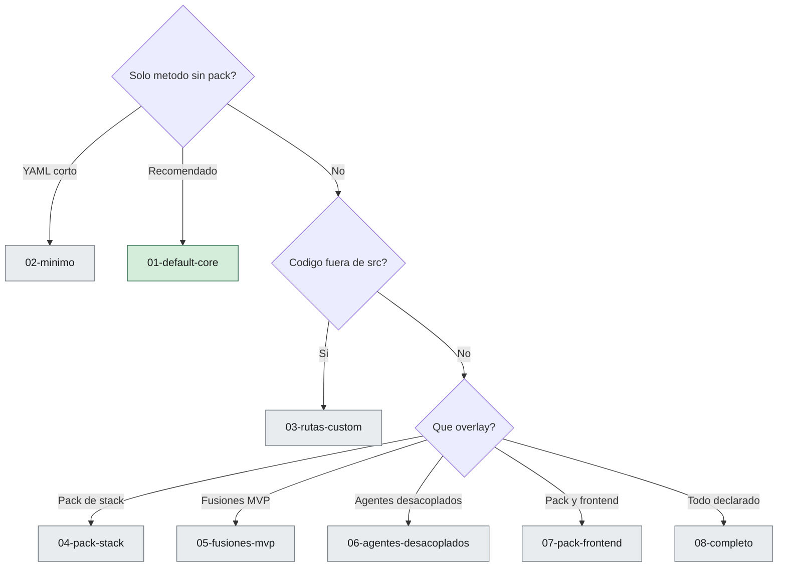

# Ejemplos de `sdaf.config.yaml`

Cada archivo es un escenario **completo y válido** en v0.3. Copia el que más se acerque y cambia `project.name`.

| Archivo | Qué ilustra |
|---------|-------------|
| [01-default-core.yaml](01-default-core.yaml) | Recomendado: solo método, 3 activos, stubs del core, sin pack ni fusiones extra |
| [02-minimo.yaml](02-minimo.yaml) | Mínimo obligatorio (defaults de rutas) |
| [03-rutas-custom.yaml](03-rutas-custom.yaml) | Código/tests fuera de `src/` y `tests/` |
| [04-pack-stack.yaml](04-pack-stack.yaml) | Overlay técnico (`stack.pack`) sin cambiar el modelo de agentes del core |
| [05-fusiones-mvp.yaml](05-fusiones-mvp.yaml) | `testing-review` y `domain-application` como fusiones explícitas |
| [06-agentes-desacoplados.yaml](06-agentes-desacoplados.yaml) | Testing y Review separados; Domain y Application activos |
| [07-pack-frontend.yaml](07-pack-frontend.yaml) | Pack + agente `frontend` (extensión; el core no lo envía) |
| [08-completo.yaml](08-completo.yaml) | Todas las claves rellenadas a la vez (referencia de techo) |

Copia canónica en la raíz del core (mismo contenido que 01): [`../sdaf.config.example.yaml`](../sdaf.config.example.yaml).

Catálogo de claves: [`../sdaf.config.schema.yaml`](../sdaf.config.schema.yaml).

---

## Cómo elegir escenario



---

## Uso de cada bloque (detalle)

### `sdaf.version`

Nombra la **línea de constitución**, no un tag. Si el consumidor dice `0.2.0` y el core avanza a la línea `0.3.0`, el upgrade es un diff explícito (submodule, copia o release), no un cambio silencioso. Los ejemplos de este árbol usan `"0.4.0"` (pin `v0.4.0`). Con pin `v0.3.3`, `sdaf.version` es `"0.3.0"`. No existe el tag `v0.3.0`.

### `project.name`

Nombre corto del producto. Se usa al generar `AGENTS.md` (`{{PROJECT_NAME}}`). No es el nombre del pack ni el de la org de GitHub, salvo que coincidan.

### `project.language`

En v0.3 **solo** `es`. Fija el idioma de commits, PRs, specs, ADRs, prompts y worklogs. No traduce el código fuente: eso lo decide el ADR de coding standards del consumidor o el pack.

### `stack.pack`

- `null`: Gate 0 y router funcionan; no hay skills `csharp-*` / `blazor-*` / equivalente.
- `"sdaf-stack-<id>@<semver>"`: el consumidor **añade** contratos, skills y (si aplica) ids de agentes de extensión. El pack **no** puede contradecir el handbook del core.

El stack concreto (lenguaje, UI, base de datos) sigue yéndose a **ADRs del consumidor**. El pack solo aporta playbooks.

### `stack.src_path` / `stack.tests_path`

Rutas relativas a la raíz del consumidor. `sdaf-gate0` trata cambios bajo `src_path` como implementación de producto. Si el código vive en `apps/api`, decláralo aquí; no hace falta enmienda al handbook.

### `agents.active` vs `agents.stubs`

| | `active` | `stubs` |
|--|----------|---------|
| Handoff canónico | Sí, por tipo de salida | No, salvo encargo humano |
| Contrato + prompt | Obligatorio | Obligatorio (listos) |
| Thrash | Cada activo cuenta | Cero si nadie los llama |

Regla práctica: con un solo supervisor, 3–5 activos. Más activos → 06 o 08 solo si hay capacidad de handoff.

### `agents.fusions`

Declara que **un** agente cubre **varios** roles.

```yaml
fusions:
  testing-review: [testing, review]
  domain-application: [domain, application]
```

Efecto en el router (`sdaf-agent-router`):

- Specs → `specification`
- ADR → `architecture`
- Tests o review de PR → `testing-review` (no `testing` ni `review`)
- Código de dominio o aplicación → `domain-application` (no los miembros por separado)

Los miembros van a `stubs` para poder desfusionar después sin inventar contratos.

### Extensiones (`frontend`, `infrastructure`, `ai`)

No están en `sdaf-core`. Solo en ejemplos 07 y 08, con `stack.pack` no nulo (o contratos locales equivalentes). Si los pones en `active` sin pack ni archivos `agents/<id>.md`, el router no tiene contrato.

---

## Errores frecuentes

> [!WARNING]
> Estos patrones dejan el router o Gate 0 en estado ambiguo. Corregir la config antes de implementar.

| Config | Problema |
|--------|----------|
| Mismo id en `active` y `stubs` | Ambigüedad; el router no sabe si invocar |
| `fusions.foo` sin `foo` en `active` | Fusión fantasma |
| `domain` y `domain-application` ambos `active` | Doble dueño del mismo diff |
| `frontend` activo y `pack: null` | Id de extensión sin playbook |
| `language: en` | No soportado en v0.3 |
| Omitir `sdaf.version` | No se sabe qué constitución del método aplica |

## Relacionado

| | Destino | Por qué |
|--|---------|---------|
| 🛠️ | [docs/adopcion-y-upgrade.md](../docs/adopcion-y-upgrade.md) | Dónde copiar el escenario |
| | [sdaf.config.schema.yaml](../sdaf.config.schema.yaml) | Catálogo de claves |
| 📦 | [contrato-pack-stack.md](../docs/contrato-pack-stack.md) | Si `stack.pack` ≠ `null` |
