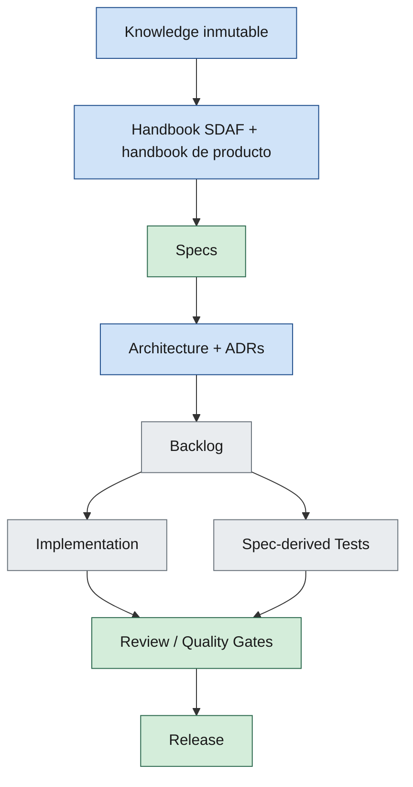

# 01 — SDAF Framework

| Campo | Valor |
|--------|--------|
| **Versión** | 0.2.2 |
| **Estado** | Approved |
| **Fecha** | 2026-09-17 |
| **Parte** | I — Método SDAF |
| **Norma superior** | [00-preface.md](00-preface.md) |
| **Deriva hacia** | [02-engineering-principles.md](02-engineering-principles.md), [03-repository-organization.md](03-repository-organization.md), [04-specification-standard.md](04-specification-standard.md), [05-development-workflow.md](05-development-workflow.md) |

---

**En esta página:** [Propósito](#1-propósito) · [Definición](#2-definición) · [Jerarquía](#3-jerarquía-normativa) · [Pipeline](#4-pipeline-de-dominio) · [Doble entregable](#5-doble-entregable) · [Gobierno](#6-gobierno-antes-de-implementar) · [Agentes](#7-agentes-en-sdaf-resumen) · [Portabilidad](#8-portabilidad)

## 1. Propósito

Definir el **Spec-Driven AI Development Framework (SDAF)**: jerarquía normativa, pipeline de artefactos y reglas de gobierno para humanos y agentes.

SDAF no es un conjunto de prompts sueltos.

---

## 2. Definición

**SDAF** es un marco Spec-Driven donde:

1. El **conocimiento** de expertos es la fuente primaria del dominio (`knowledge/`, inmutable, en el consumidor).
2. El **handbook** de este core es la constitución del método; el consumidor añade constitución de producto.
3. Las **especificaciones** en `specs/` del **repo consumidor** son la única fuente de verdad operativa para implementar.
4. El **código** y los **tests** se derivan de las specs (nunca al revés como norma).
5. Los **agentes IA** ejecutan el pipeline bajo supervisión humana y trazabilidad.

El core **exige** la carpeta `specs/` y su estándar (cap. 04). **No** incluye el contenido de specs de ningún producto.

---

## 3. Jerarquía normativa

### 3.1 Qué no es un nivel normativo

| Artefacto | Rol |
|-----------|-----|
| Agentes IA | Actores que operan el pipeline |
| Prompts | Contratos operativos versionados |
| Worklogs | Trazabilidad de iteraciones |
| Código | Resultado derivado |

### 3.2 Prioridad ante conflicto

1. Capítulos **Approved** de este handbook  
2. Handbook de producto Approved del consumidor  
3. ADRs vigentes  
4. Specs en `specs/`  
5. Backlog  
6. Implementación / prompts / worklogs  

---

## 4. Pipeline de dominio

```mermaid
flowchart LR
  K[Knowledge] --> G[Glossary]
  G --> M[Domain Model]
  M --> R[Business Rules]
  R --> C[Calculation Rules]
  C --> U[Use Cases]
  U --> A[Acceptance Tests]
  A --> I[Implementation]
  classDef norm fill:#d0e3f8,stroke:#1e4d8b,color:#1a1a1a;
  classDef ok fill:#d4edda,stroke:#2d6a4f,color:#1a1a1a;
  classDef stub fill:#e9ecef,stroke:#6c757d,color:#1a1a1a;
  class K,G,M,R,C,U norm
  class A ok
  class I stub
```

No se implementa el documento de experto “tal cual”. Se transforma.

---

## 5. Doble entregable

| Entregable | Significado |
|------------|-------------|
| Producto | Capacidad demostrable acorde al MVP / roadmap del consumidor |
| Metodología | Artefactos SDAF actualizados (specs, ADRs, worklogs, prompts) |

Acelerar el producto destruyendo la metodología es una violación de SDAF.

---

## 6. Gobierno antes de implementar

Antes de generar implementación de una feature de producto, **debe** existir:

1. Especificación aplicable (o enmienda Approved del alcance).
2. Decisión de arquitectura relevante (ADR) cuando el cambio cruza límites o stack.
3. Criterios de aceptación / tests derivados de la spec.
4. Entrada de trazabilidad (worklog) de la iteración.

> [!CAUTION]
> Si falta alguno: **STOP**. Proponer su creación; no improvisar código de producto.

El core **no** fija el stack: exige que las decisiones de stack/límites queden en ADRs (gobernanza). El pack de stack es opcional.

El pack **no puede contradecir** capítulos Approved de este handbook. El contrato operativo del pack está en [`docs/contrato-pack-stack.md`](../docs/contrato-pack-stack.md) (no se duplica el detalle aquí).

Detalle operativo en el capítulo 05.

---

## 7. Agentes en SDAF (resumen)

- Equipo especializado, no un único agente omnisciente.
- Activos y stubs se declaran en `sdaf.config.yaml` del consumidor (detalle en Parte II).
- El humano aprueba handoffs relevantes y todo capítulo Approved.
- Ningún agente puede autodeclarar Approved ni saltarse el gate del §6.

---

## 8. Portabilidad

Este capítulo **debe** poder aplicarse a otro producto y otro stack con un handbook de producto y, si aplica, un pack de stack. No menciona un producto concreto ni un runtime concreto como norma.

---

## Relacionado

| Destino | Por qué |
|---------|---------|
| [00-preface.md](00-preface.md) | Alcance de la constitución |
| [05-development-workflow.md](05-development-workflow.md) | Gates operativos |
| [docs/contrato-pack-stack.md](../docs/contrato-pack-stack.md) | Pack de stack (no contradice este capítulo) |

## 9. Historial

| Versión | Fecha | Cambio |
|---------|--------|--------|
| 0.2.2 | 2026-09-17 | TOC, Relacionado, diagramas y alerta Gate 0 (sin cambio de norma) |
| 0.2.0 | 2026-08-25 | Renumerado (ex-05); ancla normativa del pack → docs; Parte I |
| 0.1.1 | 2026-08-24 | Approved (aprobación humana del director técnico) |
| 0.1.0 | 2026-08-24 | Extracción genérica (ADR-008): norma de `specs/` y gobernanza de stack explícitas |
