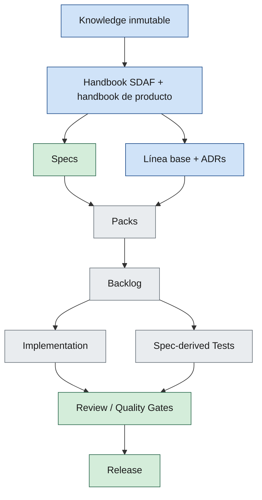
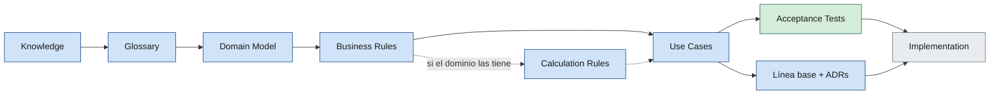

# 01 — SDAF Framework

> Andamiaje (cabecera, TOC, Relacionado, Historial): `_meta/01-sdaf-framework.yaml`.

## 1. Propósito

Definir el **Spec-Driven AI Development Framework (SDAF)**: jerarquía normativa, pipeline de artefactos y reglas de gobierno para humanos y agentes.

SDAF no es un conjunto de prompts sueltos.

---

## 2. Definición

**SDAF** es un marco Spec-Driven donde:

1. El **conocimiento** de expertos es la fuente primaria del dominio (`knowledge/`, inmutable, en el consumidor).
2. El **handbook** de este core es la constitución del método; el consumidor añade constitución de producto.
3. Las **especificaciones** en `specs/` del **repo consumidor** son la única fuente de verdad operativa para implementar.
4. El **código** y los **tests** se derivan de las specs (nunca al revés como norma).
5. Los **agentes IA** ejecutan el pipeline bajo supervisión humana y trazabilidad.

El core **exige** la carpeta `specs/` y su estándar (cap. 04). **No** incluye el contenido de specs de ningún producto.

---

## 3. Jerarquía normativa

```mermaid
flowchart TD
  K[Knowledge inmutable] --> HB[Handbook SDAF + handbook de producto]
  HB --> S[Specs]
  HB --> ADR[Línea base + ADRs]
  S --> P[Packs]
  ADR --> P
  P --> B[Backlog]
  B --> IMP[Implementation]
  B --> TST[Spec-derived Tests]
  IMP --> G[Review / Quality Gates]
  TST --> G
  G --> REL[Release]
  classDef norm fill:#d0e3f8,stroke:#1e4d8b,color:#1a1a1a;
  classDef ok fill:#d4edda,stroke:#2d6a4f,color:#1a1a1a;
  classDef stub fill:#e9ecef,stroke:#6c757d,color:#1a1a1a;
  class K,HB,ADR norm
  class S,G,REL ok
  class P,B,IMP,TST stub
```

El diagrama muestra la **derivación de artefactos**, no un orden de prioridad entre spec y ADR: ambos derivan del handbook, quedan al mismo nivel y los packs están subordinados a los dos. La prioridad ante conflicto es la de §3.2. Por la misma razón, el orden de pasos de [H05 §2](05-development-workflow.md) (spec antes que ADR) es **temporal** (qué se produce primero), no de prioridad.

### 3.1 Qué no es un nivel normativo

| Artefacto | Rol |
|-----------|-----|
| Agentes IA | Actores que operan el pipeline |
| Prompts | Contratos operativos versionados |
| Worklogs | Trazabilidad de iteraciones |
| Código | Resultado derivado |

### 3.2 Prioridad ante conflicto

Precedencia única ([ADR-007](../architecture/decisions/ADR-007-modelo-de-capas-y-precedencia.md) §2):

1. Capítulos **Approved** de este handbook  
2. Handbook de producto Approved del consumidor  
3. Línea base Approved ([H14](14-architecture-description.md)) y ADRs vigentes del consumidor, **junto con** las specs Approved en `specs/`. No se ordenan entre sí: la spec manda sobre *qué* debe cumplirse y el ADR sobre *cómo* se construye  
4. Packs de stack  
5. Backlog  
6. Prompts, skills locales, worklogs e implementación  

Reglas de resolución:

- Un conflicto entre una spec Approved y un ADR vigente es **STOP**: se resuelve enmendando uno de los dos, nunca en silencio durante la implementación.
- Un pack no contradice las capas superiores. Si choca con un ADR del consumidor, gana el ADR y la skill del pack se marca `N/A: <motivo>` en el worklog.
- «ADRs vigentes» son los Aceptados y no sustituidos ([ADR-006](../architecture/decisions/ADR-006-ciclo-de-vida-de-adrs.md)).

---

## 4. Pipeline de dominio

```mermaid
flowchart LR
  K[Knowledge] --> G[Glossary]
  G --> M[Domain Model]
  M --> R[Business Rules]
  R --> U[Use Cases]
  R -.->|si el dominio las tiene| C[Calculation Rules]
  C -.-> U
  U --> A[Acceptance Tests]
  U --> AR[Línea base + ADRs]
  A --> I[Implementation]
  AR --> I
  classDef norm fill:#d0e3f8,stroke:#1e4d8b,color:#1a1a1a;
  classDef ok fill:#d4edda,stroke:#2d6a4f,color:#1a1a1a;
  classDef stub fill:#e9ecef,stroke:#6c757d,color:#1a1a1a;
  class K,G,M,R,C,U,AR norm
  class A ok
  class I stub
```

«Calculation Rules» es un **paso opcional**: reglas derivadas, solo si el dominio las tiene (la línea punteada se omite sin romper el pipeline). El eslabón de **arquitectura** (línea base y ADRs, [H14](14-architecture-description.md)) no deriva del dominio: se decide y se registra en ADRs, recibe de los casos de uso los requisitos que debe acomodar y, junto con los tests de aceptación, acota la implementación.

No se implementa el documento de experto “tal cual”. Se transforma.

---

## 5. Doble entregable

| Entregable | Significado |
|------------|-------------|
| Producto | Capacidad demostrable acorde al MVP / roadmap del consumidor |
| Metodología | Artefactos SDAF actualizados (specs, ADRs, worklogs, prompts) |

Acelerar el producto destruyendo la metodología es una violación de SDAF.

---

## 6. Gobierno antes de implementar

Antes de generar implementación de una feature de producto, **debe** existir:

1. Especificación aplicable (o enmienda Approved del alcance).
2. Decisión de arquitectura relevante (ADR) cuando el cambio cruza límites o stack.
3. Criterios de aceptación / tests derivados de la spec.
4. Entrada de trazabilidad (worklog) de la iteración.

> [!CAUTION]
> Si falta alguno: **STOP**. Proponer su creación; no improvisar código de producto.

El core **no** fija el stack: exige que las decisiones de stack/límites queden en ADRs (gobernanza). El pack de stack es opcional.

El pack **no puede contradecir** capítulos Approved de este handbook. El contrato operativo del pack está en [`docs/contrato-pack-stack.md`](../docs/contrato-pack-stack.md) (no se duplica el detalle aquí).

Detalle operativo en el capítulo 05.

---

## 7. Agentes en SDAF (resumen)

- Equipo especializado, no un único agente omnisciente.
- Activos y stubs se declaran en `sdaf.config.yaml` del consumidor (detalle en Parte II).
- El humano aprueba handoffs relevantes y todo capítulo Approved.
- Ningún agente puede autodeclarar Approved ni saltarse el gate del §6.

---

## 8. Portabilidad

Este capítulo **debe** poder aplicarse a otro producto y otro stack con un handbook de producto y, si aplica, un pack de stack. No menciona un producto concreto ni un runtime concreto como norma.

---
