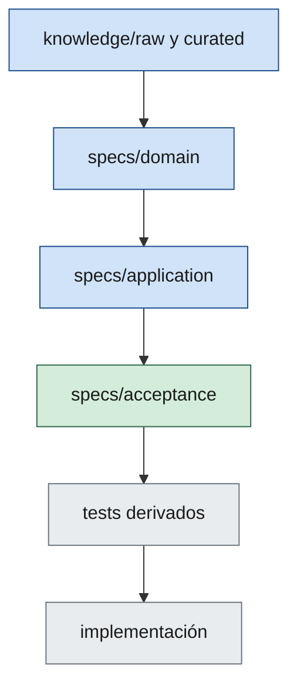

# 04 — Specification Standard

> Andamiaje (cabecera, TOC, Relacionado, Historial): `_meta/04-specification-standard.yaml`.

## 1. Propósito

Definir qué es una especificación válida: formato mínimo, tipos, estados, trazabilidad y relación con knowledge, ADRs y código.

**Norma canónica:** en todo proyecto bajo SDAF, la verdad operativa para implementar está en `specs/` del repo consumidor. Este capítulo estandariza esa carpeta; no la rellena.

Sin este estándar, “tener una spec” es ambiguo y el Gate 0 no es auditable.

---

## 2. Definición

Una **especificación** es un artefacto versionado en `specs/` que describe de forma **testeable** qué debe cumplirse, con criterios de aceptación explícitos y referencias a knowledge/handbook/ADRs cuando aplique.

No es un ensayo sin criterios, ni un ticket de backlog (el backlog **apunta** a specs), ni un PR description como única fuente.

---

## 3. Tipos y ubicación

| Tipo | Carpeta | Contenido típico |
|------|---------|------------------|
| Producto | `specs/product/` | Capabilities, journeys, NFRs de producto |
| Dominio | `specs/domain/` | Glossary, modelo, reglas hard/soft, invariantes |
| Aplicación | `specs/application/` | Casos de uso, comandos/consultas, contratos a nivel app |
| Aceptación | `specs/acceptance/` | Escenarios Given/When/Then mapeables a tests |
| Integración | `specs/integration/` | Contratos entre unidades o con terceros |

Una capacidad puede tener varios archivos enlazados; **una fuente canónica** y referencias.

---

## 4. Cabecera obligatoria

| Campo | Descripción |
|--------|-------------|
| Título | Nombre estable |
| ID | Identificador único (p. ej. `SPEC-DOM-001`) |
| Versión | Semver o `MAJOR.MINOR` |
| Estado | `Draft` / `Approved` / `Deprecated` |
| Fecha | Última actualización |
| Fuentes | Rutas en `knowledge/` y capítulos de handbook |
| ADRs relacionados | Si aplica |
| PBIs / backlog | IDs vinculados |
| Derivados | Tests, slices, worklogs esperados |
| Unidades | Unidades de la línea base ([H14](14-architecture-description.md)) a las que afecta la spec, con los nombres exactos de la línea base |
| Origen | Opcional. Procedencia de la spec cuando no nace de un PBI nuevo, p. ej. la descripción de código anterior a la adopción ([ADR-008](../architecture/decisions/ADR-008-adopcion-sobre-codigo-existente.md)). Los valores permitidos los fija el procedimiento de adopción |

Solo specs **Approved** autorizan implementación de producto (salvo spike explícito con ADR de excepción y fecha de caducidad).

---

## 5. Contenido mínimo por tipo

### 5.1 Dominio — Glossary / Ubiquitous Language

Término, definición, sinónimos prohibidos, contexto.

### 5.2 Dominio — Model / Rules

Aggregates/entities/VOs a nivel conceptual; invariantes; reglas **Hard** vs **Soft** etiquetadas; ejemplos y contraejemplos.

### 5.3 Application — Use cases

Actor, precondiciones, flujo, postcondiciones; comandos/queries por nombre, no código.

### 5.4 Acceptance

Observables, independientes en lo razonable, trazables. Formato preferido:

```text
Dado [contexto]
Cuando [acción]
Entonces [resultado observable]
```

### 5.5 Atributos de calidad

Cada atributo de calidad priorizado en la línea base (sección 5, [H14 §3](14-architecture-description.md)) tiene al menos un **escenario medible**. Un atributo sin medida no es testeable y no cuenta como especificado.

Un escenario se describe con cinco campos:

| Campo | Qué declara |
|-------|-------------|
| Fuente | Quién o qué origina el estímulo (persona, sistema externo, proceso interno) |
| Estímulo | El evento que el sistema recibe |
| Entorno | La condición de operación en la que ocurre (normal, carga alta, degradado) |
| Respuesta | Lo que el sistema hace ante el estímulo |
| Medida | El valor verificable de la respuesta (umbral, porcentaje, tiempo) |

Ejemplo neutral:

| Atributo | Fuente | Estímulo | Entorno | Respuesta | Medida |
|----------|--------|----------|---------|-----------|--------|
| Atributo A | Usuario autenticado | Solicita una operación habitual | Operación normal | El sistema devuelve el resultado | El 95 % de las solicitudes se resuelve en menos de N unidades de tiempo |

La spec es la fuente canónica del escenario: la línea base prioriza los atributos, puede resumir el escenario y siempre enlaza la spec; si ambos difieren, se corrige la línea base. Si la línea base no prioriza ningún atributo, esta sección se escribe `N/A: <motivo>`.

### 5.6 Integración

Una spec de integración (`specs/integration/`) define un contrato entre unidades o con terceros. Contenido mínimo:

- **Partes que se integran:** las unidades implicadas, con los nombres de la línea base, o el tercero.
- **Contrato:** los datos o el comportamiento que se intercambian, en qué sentido y con qué precondiciones y postcondiciones, sin código.
- **Errores y fallos esperados:** qué ocurre cuando una parte no responde, responde mal o incumple el contrato.
- **Versionado del contrato:** cómo evoluciona y qué cambios son incompatibles (sección 7).

La sección 4 de la línea base (Integraciones y contratos, [H14 §3](14-architecture-description.md)) enumera las integraciones y enlaza estas specs; el contrato vive en la spec, no en la línea base.

---

## 6. Pipeline de elaboración



1. No saltar de knowledge a código.
2. Si una acceptance contradice una regla de dominio, se corrige antes de codear.
3. Alcance diferido se marca explícitamente en la spec (`Implementación: diferida`).

---

## 7. Versionado y cambios

- Cambio incompatible de comportamiento → versión mayor de la spec y tests.
- Specs Approved solo cambian con revisión humana explícita.
- Deprecated: dejar archivo con puntero al sucesor.

---

## 8. Relación con ADRs

| Pregunta | Artefacto |
|----------|-----------|
| ¿Qué debe hacer el negocio/sistema? | Spec |
| ¿Qué opción técnica (incl. stack) elegimos y por qué? | ADR |
| ¿Está permitido por la constitución? | Handbook |
| ¿Qué arquitectura vigente describe el sistema? | Línea base ([H14](14-architecture-description.md)) |

Una spec no sustituye un ADR de stack o de límites.

---
