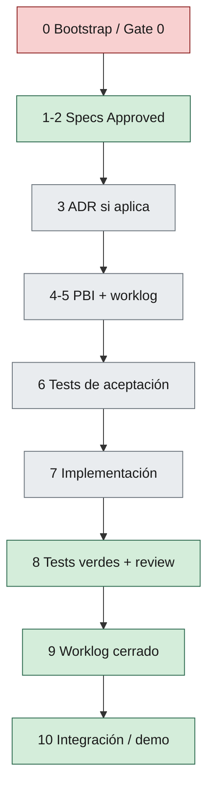

# 05 — Development Workflow

> Andamiaje (cabecera, TOC, Relacionado, Historial): `_meta/05-development-workflow.yaml`.

## 1. Propósito

Flujo de trabajo de backlog a release, con **gates** obligatorios para humanos y agentes.

Un solo camino. No hay atajo de agente.

---

## 2. Flujo de extremo a extremo

**Paso 0 — Bootstrap del repo** (skill [`sdaf-bootstrap`](../skills/sdaf-bootstrap/SKILL.md)): árbol y `sdaf.config.yaml` listos según [cap. 03](03-repository-organization.md) y [`docs/adopcion-y-upgrade.md`](../docs/adopcion-y-upgrade.md). En un repo vacío, Gate 0 → **STOP** esperado hasta specs Approved.



Pasos en texto:

```text
1. Knowledge disponible (si dominio)
2. Specs Draft → revisión → Approved
3. ADR si hay decisión arquitectónica / de stack / de alcance técnico
4. PBI en backlog enlazado a specs + acceptance
5. Worklog de iteración abierto
6. Tests de aceptación (esqueleto o completos) derivados de specs
7. Implementación (vertical slice)
8. Tests verdes + review
9. Worklog cerrado
10. Integración / demo según el MVP del consumidor
```

Para documentación constitucional (handbook): flujo Draft → revisión humana → Approved, no este pipeline de features.

---

## 3. Gate 0 — Pre-implementación (STOP)

Antes de escribir código de producto, **deben** cumplirse:

| # | Requisito | Evidencia |
|---|-----------|-----------|
| G0.1 | Spec(s) **Approved** aplicables | Rutas en `specs/` |
| G0.2 | Acceptance criteria definidos | `specs/acceptance/` o sección en spec |
| G0.3 | ADR si el cambio toca límites, stack o motores | `architecture/decisions/` o N/A justificado en worklog |
| G0.4 | PBI/backlog enlazado | `backlog/` |
| G0.5 | Worklog de iteración iniciado | `worklogs/...` |

> [!CAUTION]
> Gate 0. Si falta G0.1–G0.5, **STOP**. No hay atajo de agente.

> [!NOTE]
> **Excepción:** spike técnico acotado, con ADR de excepción, duración máxima y sin merge a demo sin convertir a spec+tests.

---

## 4. Gate 1 — Durante la implementación

| # | Regla |
|---|--------|
| G1.1 | Seguir el prompt/agente versionado; registrar versión en worklog |
| G1.2 | No ampliar alcance Out del MVP del consumidor sin enmienda |
| G1.3 | Preferir cambios en una vertical slice coherente |
| G1.4 | Actualizar worklog al cerrar la iteración |
| G1.5 | Commits en castellano. Cuándo crearlos o escribir el remoto: [H06 §7](06-ai-agent-framework.md#7-restricciones-globales) (petición **en este turno**; excepción del consumidor acotada) |

---

## 5. Gate 2 — Listo para revisión / merge

| # | Requisito |
|---|-----------|
| G2.1 | Acceptance tests del PBI en verde (o justificación ADR temporal) — detalle QG-Accept en [H10](10-code-review-and-quality-gates.md) |
| G2.2 | Ninguna contradicción consciente con specs Approved |
| G2.3 | Review con checklist ([H10](10-code-review-and-quality-gates.md) si el consumidor pinnea 0.3) |
| G2.4 | Worklog cerrado / listo |
| G2.5 | Runtime local sigue arrancando según runbook del consumidor (si aplica) — [H11](11-devops.md) |

---

## 6. Gate 3 — Cierre de release / demo

Los criterios concretos de DoD de producto (duración de demo, artefactos de presentación, etiqueta de versión) los fija el handbook de producto del consumidor. Este gate exige que Gates 0–2 estén cerrados en el conjunto In del MVP.

---

## 7. Roles en el flujo

| Rol | Responsabilidad |
|-----|-----------------|
| Humano (Director técnico / PO) | Aprueba specs/handbook; excepciones; valida demo |
| Specification | Knowledge → specs |
| Architecture | ADRs, boundaries |
| Agentes de implementación | Los declara `sdaf.config` / pack de stack |
| Testing+Review | Tests, gates, review |

Handoffs: el saliente deja worklog + artefactos; el entrante no asume chat no registrado.

---

## 8. Violaciones

> [!CAUTION]
> Implementación de producto fusionada o presentada **sin** Gate 0 es violación SDAF.
> Debe registrarse, revertirse o regularizarse (spec retroactiva **prohibida** como hábito; solo con ADR de excepción y plan de corrección).

---
