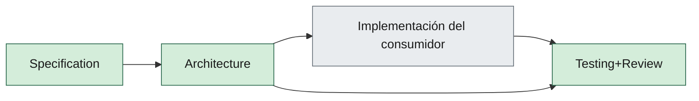

# 06 — AI Agent Framework

| Campo | Valor |
|--------|--------|
| **Versión** | 0.3.0 |
| **Estado** | Approved |
| **Fecha** | 2026-09-18 |
| **Parte** | II — Ingeniería IA |
| **Norma superior** | [01-sdaf-framework.md](01-sdaf-framework.md), [05-development-workflow.md](05-development-workflow.md) |
| **Deriva hacia** | `agents/`, `prompts/agents/`, `skills/`, [07-prompt-engineering-standard.md](07-prompt-engineering-standard.md), [08-agent-traceability.md](08-agent-traceability.md) |

---

**En esta página:** [Propósito](#1-propósito) · [Distinción](#2-distinción-crítica) · [Modelo](#3-modelo-operativo) · [Contrato](#4-contrato-de-agente-obligatorio) · [Handoffs](#5-orquestación-y-handoffs) · [Skills](#6-skills) · [Restricciones](#7-restricciones-globales)

## 1. Propósito

Definir el equipo de agentes de **ingeniería** (desarrollo). No confundir con una eventual IA de producto del consumidor.

Los agentes ejecutan el pipeline SDAF. No son un nivel normativo. No aprueban capítulos Approved ni saltan Gate 0.

---

## 2. Distinción crítica

| Tipo | Dónde | Rol |
|------|-------|-----|
| Agentes de ingeniería (este capítulo) | `agents/`, `prompts/` | Specs, ADRs, código, tests, docs |
| IA de producto | Infraestructura del consumidor (si existe) | Fuera del alcance de este core |

---

## 3. Modelo operativo

**Problema:** demasiados agentes activos con un solo supervisor generan thrash.

**Decisión del core:** pocos **activos** + **stubs** (contrato + prompt listos). La lista concreta la fija `sdaf.config.yaml`.

Por defecto en v0.2:

### 3.1 Activos

| Agente | Objetivo | Salidas típicas |
|--------|----------|-----------------|
| Specification | Knowledge → specs/acceptance | `specs/**` |
| Architecture | Boundaries, ADRs | `architecture/decisions/**` |
| Testing+Review | Tests derivados, gates, review | `tests/**`, dictámenes |

### 3.2 Stubs

Product, Domain, Application, DevOps, Review (puro), Testing (puro).

Un stub **debe** tener contrato, prompt base y estado `stub` visible.

Agentes de implementación de UI/infra/stack (p. ej. Frontend) los aporta el **pack de stack** o el consumidor; no son norma de este core.

---

## 4. Contrato de agente (obligatorio)

Cada agente en `agents/` documenta: objetivo, responsabilidades, entradas, salidas, restricciones, checklist, KPIs, Definition of Done, prompt base y **contexto autorizado**.

El contexto autorizado es un **índice** (tabla de capas: rol, flujo/skills, reglas IDE). El agente **abre** esos artefactos; no los concatena en un mega-prompt. El resumen de una línea no sustituye al prompt versionado: si discrepan, gana el prompt.

`AGENTS.md` en el consumidor actúa como **router** (materializado desde `AGENTS.md.template`).

---

## 5. Orquestación y handoffs

1. El saliente cierra worklog con “siguiente agente”.
2. El entrante lee worklog + specs; **no** depende de chat no registrado.
3. El humano puede reordenar o fusionar pasos; no puede omitir Gate 0.

---

## 6. Skills

Las **skills** viven en `skills/` (índice vivo: [`skills/README.md`](../skills/README.md)). Tool-agnostic: no dependen de `.cursor/skills/`.

| Capa | Contiene |
|------|----------|
| Contrato + prompt | *Quién* / rol |
| Skill (`SKILL.md`) | *Cómo* (flujo) |
| Rules IDE | Restricciones locales finas |

Citar `skill-id@version` en el worklog. Gate 0 manda sobre cualquier skill de implementación.

Catálogo core:

| Prioridad | Skills |
|-----------|--------|
| Alta | `sdaf-gate0`, `sdaf-worklog-handoff`, `sdaf-agent-router`, `sdaf-bootstrap`, `testing-review-pr` (Draft 0.3.0) |
| Media | `spec-draft-pbi`, `adr-propose`, `sdaf-upgrade`, `security-review` (Draft 0.3.0) |
| Baja | `devops-ci-gate` (Draft 0.3.0) |

---

## 7. Restricciones globales

- Castellano en artefactos de ingeniería.
- Respetar handbook y specs Approved.
- No inventar alcance Out del MVP del consumidor.
- No marcar Approved.
- No force-push ni destruir history sin orden humana.
- No introducir secretos.
- Economía de tokens (cap. 07).

---

## Relacionado

| Destino | Por qué |
|---------|---------|
| [skills/README.md](../skills/README.md) | Catálogo de playbooks |
| [07-prompt-engineering-standard.md](07-prompt-engineering-standard.md) | Economía de tokens; no mega-prompt |
| [AGENTS.md.template](../AGENTS.md.template) | Router a materializar |
| [10-code-review-and-quality-gates.md](10-code-review-and-quality-gates.md) | Checklist Testing+Review (Draft 0.3.0) |

## 8. Historial

| Versión | Fecha | Cambio |
|---------|--------|--------|
| 0.3.0 | 2026-09-18 | Catálogo: testing-review-pr, security-review, devops-ci-gate (Draft) |
| 0.2.2 | 2026-09-17 | TOC, Relacionado, diagrama con color (sin cambio de norma) |
| 0.2.1 | 2026-09-13 | Contexto autorizado en el contrato (índice; no mega-prompt) |
| 0.2.0 | 2026-08-25 | Renumerado (ex-13); catálogo + bootstrap/upgrade; Parte II |
| 0.1.1 | 2026-08-24 | Approved (aprobación humana del director técnico) |
| 0.1.0 | 2026-08-24 | Agentes genéricos; implementación de stack fuera del core (ADR-008) |
