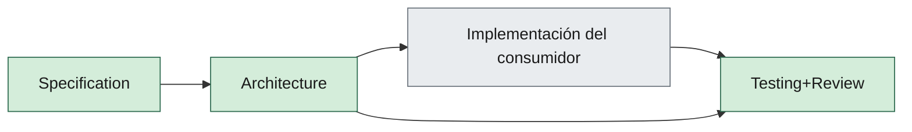

# 06 — AI Agent Framework

> Andamiaje (cabecera, TOC, Relacionado, Historial): `_meta/06-ai-agent-framework.yaml`.

## 1. Propósito

Definir el equipo de agentes de **ingeniería** (desarrollo). No confundir con una eventual IA de producto del consumidor.

Los agentes ejecutan el pipeline SDAF. No son un nivel normativo. No aprueban capítulos Approved ni saltan Gate 0.

---

## 2. Distinción crítica

| Tipo | Dónde | Rol |
|------|-------|-----|
| Agentes de ingeniería (este capítulo) | `agents/`, `prompts/` | Specs, ADRs, código, tests, docs |
| IA de producto | Infraestructura del consumidor (si existe) | Fuera del alcance de este core |

---

## 3. Modelo operativo

**Problema:** demasiados agentes activos con un solo supervisor generan thrash.

**Decisión del core:** pocos **activos** + **stubs** (contrato + prompt listos). La lista concreta la fija `sdaf.config.yaml`.

Por defecto en v0.2:

### 3.1 Activos

| Agente | Objetivo | Salidas típicas |
|--------|----------|-----------------|
| Specification | Knowledge → specs/acceptance | `specs/**` |
| Architecture | Boundaries, ADRs | `architecture/decisions/**` |
| Testing+Review | Tests derivados, gates, review | `tests/**`, dictámenes |

### 3.2 Stubs

Product, Domain, Application, DevOps, Review (puro), Testing (puro).

Un stub **debe** tener contrato, prompt base y estado `stub` visible.

Agentes de implementación de UI/infra/stack (p. ej. Frontend) los aporta el **pack de stack** o el consumidor; no son norma de este core.

---

## 4. Contrato de agente (obligatorio)

Cada agente en `agents/` documenta: objetivo, responsabilidades, entradas, salidas, restricciones, checklist, KPIs, Definition of Done, prompt base y **contexto autorizado**.

El contexto autorizado es un **índice** (tabla de capas: rol, flujo/skills, reglas IDE). El agente **abre** esos artefactos; no los concatena en un mega-prompt. El resumen de una línea no sustituye al prompt versionado: si discrepan, gana el prompt.

`AGENTS.md` en el consumidor actúa como **router** (materializado desde `AGENTS.md.template`).

---

## 5. Orquestación y handoffs

1. El saliente cierra worklog con “siguiente agente”.
2. El entrante lee worklog + specs; **no** depende de chat no registrado.
3. El humano puede reordenar o fusionar pasos; no puede omitir Gate 0.

---

## 6. Skills

Las **skills** viven en `skills/` (índice vivo: [`skills/README.md`](../skills/README.md)). Tool-agnostic: no dependen de `.cursor/skills/`.

| Capa | Contiene |
|------|----------|
| Contrato + prompt | *Quién* / rol |
| Skill (`SKILL.md`) | *Cómo* (flujo) |
| Rules IDE | Restricciones locales finas (core: `idioma-castellano`, `git-remoto-encargo`; esta última copia §7, no la exceptúa) |

Citar `skill-id@version` en el worklog. Gate 0 manda sobre cualquier skill de implementación.

Catálogo core:

| Prioridad | Skills |
|-----------|--------|
| Alta | `sdaf-gate0`, `sdaf-worklog-handoff`, `sdaf-agent-router`, `sdaf-bootstrap`, `testing-review-pr`, `security-review` |
| Media | `spec-draft-pbi`, `adr-propose`, `sdaf-upgrade` |
| Baja | `devops-ci-gate` |

---

## 7. Restricciones globales

- Castellano en artefactos de ingeniería.
- Respetar handbook y specs Approved.
- No inventar alcance Out del MVP del consumidor.
- No marcar Approved.
- No alterar **refs ni contenidos del remoto del proyecto** ni crear **commit** local sin petición humana **explícita** en el encargo vigente. El criterio es el **efecto** (el remoto cambia), no el comando: commit, push (cualquier remote), tags, releases, merge (incluido auto-merge), abrir o actualizar pull request, APIs de contenidos (p. ej. Contents/Git Data), disparar CI que escriba el repo. Terminar archivos, tests o un DoD **no** autoriza git ni escritura remota.
- **Encargo vigente** = el mensaje de usuario **de este turno**. Un turno anterior de la misma conversación, un PR abierto, «así se publica» o el hábito de la sesión **no** autorizan git ni el remoto. Si este mensaje no nombra commit, push, PR, tag, release o merge, esas acciones están **prohibidas**. Autoriza solo lo nombrado (p. ej. «commit» no implica push; «PR» implica el push de rama imprescindible para abrir ese PR).
- El consumidor puede **exceptuar** las dos viñetas anteriores por cláusula en su `AGENTS.md` o por ADR. La cláusula **debe** enumerar qué permite (p. ej. solo commit local, o commit + push + PR). Lo no enumerado sigue prohibido. Ninguna excepción cubre force-push, reescribir historia ni auto-merge: siguen exigiendo orden humana (esta sección y skill [`testing-review-pr`](../skills/testing-review-pr/SKILL.md)).
- No force-push ni destruir history sin orden humana.
- No introducir secretos.
- Economía de tokens (cap. 07).

---
