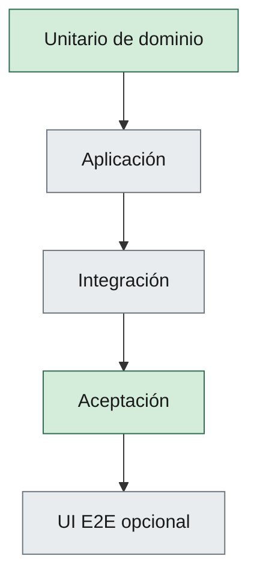

# 09 — Testing Framework

| Campo | Valor |
|--------|--------|
| **Versión** | 0.3.0 |
| **Estado** | Approved |
| **Fecha** | 2026-09-19 |
| **Parte** | III — Calidad y entrega |
| **Norma superior** | [04-specification-standard.md](04-specification-standard.md), [05-development-workflow.md](05-development-workflow.md), [02-engineering-principles.md](02-engineering-principles.md) |
| **Deriva hacia** | `tests/` del consumidor, Gate 2, [10-code-review-and-quality-gates.md](10-code-review-and-quality-gates.md) |

---

**En esta página:** [Propósito](#1-propósito) · [Principio](#2-principio-rector) · [Pirámide](#3-pirámide-por-nivel) · [Cobertura](#4-cobertura-bloqueante) · [Organización](#5-organización-en-tests) · [Datos](#6-datos-de-prueba)

## 1. Propósito

Definir la estrategia de pruebas del **método**: origen en specs, pirámide por nivel y qué es bloqueante para Gate 2 / demo.

Las herramientas concretas (runner, contenedores, E2E) las fija el ADR o el pack de stack del consumidor. Este capítulo no nombra un runtime.

---

## 2. Principio rector

Los tests de aceptación se **derivan** de `specs/acceptance/` (y de los criterios de las specs Approved).

Un test que no traza a spec es útil como caracterización, pero **no** sustituye el acceptance del PBI.

Alinea H02 §2.8 (Test from Specs).

---

## 3. Pirámide por nivel

| Nivel | Qué cubre | Quién fija herramientas |
|-------|-----------|-------------------------|
| Unitario (dominio) | Invariantes y reglas de negocio expresadas en specs | ADR / pack del consumidor |
| Aplicación | Casos de uso / handlers con dobles cuando aporte | ADR / pack |
| Integración | Persistencia u otros límites reales | ADR / pack |
| Aceptación | Flujo crítico del PBI / demo | ADR / pack |
| UI E2E | Opcional; no es puerta única del DoD | ADR / pack |

Prioridad: **dominio + acceptance del flujo tocado** por encima de E2E exhaustivo.

---

## 4. Cobertura bloqueante

Deben existir y estar verdes para Gate 2 del PBI (H05 §5):

1. Tests trazables a los criterios de aceptación del PBI.
2. Acceptance del flujo tocado (no un subconjunto “cómodo”).
3. El smoke de runtime que el runbook del consumidor declare, si el diff lo afecta (H11).

La cobertura de líneas **no** es KPI primario del método.

---

## 5. Organización en `tests/`

La carpeta `tests/` es normativa (H03). El layout interno (proyectos, namespaces) lo decide el consumidor.

Nombrar tests según el escenario de acceptance, no según el detalle de implementación.

---

## 6. Datos de prueba

- Builders/mothers en tests; evitar estado compartido sucio entre pruebas.
- Seed de demo (runtime) ≠ fixtures de test; no acoplarlos sin decisión explícita.

---

## Relacionado

| Destino | Por qué |
|---------|---------|
| [04-specification-standard.md](04-specification-standard.md) | Acceptance como verdad operativa |
| [05-development-workflow.md](05-development-workflow.md) | Gate 2 exige acceptance verdes |
| [10-code-review-and-quality-gates.md](10-code-review-and-quality-gates.md) | QG-Unit / QG-Accept |
| [prompts/quality/testing-strategy.md](../prompts/quality/testing-strategy.md) | Plan de tests por nivel |

## 7. Historial

| Versión | Fecha | Cambio |
|---------|--------|--------|
| 0.3.0 | 2026-09-19 | Approved (aprobación humana del director técnico) |
| 0.3.0 | 2026-09-18 | Draft: trasplante genérico del extract H16 (ADR-008) |
