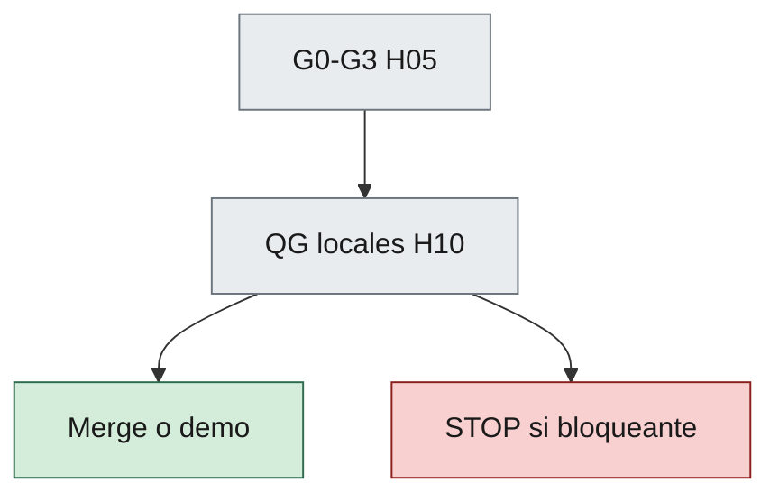

# 10 — Code Review and Quality Gates

> Andamiaje (cabecera, TOC, Relacionado, Historial): `_meta/10-code-review-and-quality-gates.yaml`.

## 1. Propósito

Unificar **code review** y **quality gates** para humanos y agentes: qué se revisa y qué bloquea integrar o declarar demo lista.

Los Gates G0–G3 del [capítulo 05](05-development-workflow.md) siguen vigentes. Este capítulo detalla el checklist de review y los gates técnicos (QG-*).

---

## 2. Quién revisa

| Revisor | Alcance |
|---------|---------|
| Humano | Arquitectura sensible, alcance del MVP del consumidor, Approved, **merge** a la rama de demo/integración |
| Testing+Review | Checklist de este capítulo, tests, regresiones obvias, **dictamen** (no el merge) |
| Architecture | Solo si el diff toca boundaries / ADRs |

Ningún agente aprueba enmiendas constitucionales.

Completar el checklist §3 por un agente **no** satisface QG-Review. Auto-merge sigue prohibido ([H06 §7](06-ai-agent-framework.md#7-restricciones-globales)).

«Nominada» es la identidad listada en [`CODEOWNERS`](../CODEOWNERS) de este repo (o el CODEOWNERS del consumidor). Esa persona puede aprobar su propio PR. No se exige un segundo humano. Decisión cerrada el 2026-09-24 ([H13 §7](13-enmienda-excepciones-ciclo-de-vida.md), [ADR-002](../architecture/decisions/ADR-002-gobernanza-del-metodo.md)).

---

## 3. Checklist de code review

### 3.1 Gobierno

- [ ] Gate 0 cumplido (specs / ADR si aplica / acceptance / worklog).
- [ ] Sin alcance Out del MVP del consumidor.
- [ ] Worklog actualizado y prompt versionado citado.
- [ ] Si el diff toca código de producto: origen de cambios en el worklog ([H08 §4.3](08-agent-traceability.md#43-origen-de-cambios)).
- [ ] Aprobación humana nominada del merge (QG-Review): la identidad de CODEOWNERS.

### 3.2 Dominio y arquitectura

- [ ] Reglas de negocio no viven solo en UI/API si el ADR de arquitectura del consumidor las sitúa en dominio.
- [ ] Dependencias y límites del ADR de arquitectura respetados.
- [ ] Sin contradicción consciente con specs Approved.

### 3.3 Calidad

- [ ] Tests nuevos o actualizados alineados a acceptance (H09).
- [ ] Nombres alineados al lenguaje de las specs.
- [ ] Sin secretos ni credenciales en claro en el repo (H12).
- [ ] Logging útil sin ruido excesivo y sin secretos.

### 3.4 Coding standards del consumidor (QG-Docs)

Si existe ADR o pack de coding standards, el diff **debe** cumplir ese checklist. El core **no** fija lenguaje, tipado, XML docs ni estilo.

Si no existe ese ADR, QG-Docs es N/A (justificar en worklog).

### 3.5 Producto y runtime

- [ ] Auth / roles no rotos si el diff los toca (H12 + ADR de auth del consumidor).
- [ ] Runbook local sigue siendo válido si cambia la composición (H11).

### 3.6 Seguridad (H12)

Cuando el diff toque auth, sesión, endpoints, secretos, dependencias o input externo — checklist en [12-security-standards.md](12-security-standards.md) §5.1:

- [ ] Sin secretos nuevos en el diff.
- [ ] Autorización coherente en API (y UI si aplica).
- [ ] Sin injection obvia; sin SSRF; CVE crítica identificada en dependencias nuevas/actualizadas o ADR de excepción.
- [ ] Alineado al ADR de auth / ACC si aplica.

---

## 4. Quality gates técnicos

| Gate | Condición | Bloquea |
|------|-----------|---------|
| QG-Build | El producto compila / empaqueta según el runbook del consumidor | Merge / demo |
| QG-Unit | Tests unitarios de dominio (+ aplicación relevantes) verdes | Merge / demo |
| QG-Accept | Acceptance del PBI / flujo tocado verdes | Merge a línea de demo |
| QG-Arch | Sin violaciones nuevas de dependencia (manual o test de arquitectura) | Merge si hay infracción nueva |
| QG-Docs | Diff cumple el ADR/pack de coding standards **si existe** | Merge |
| QG-Sec | Condiciones de [H12 §5.2](12-security-standards.md#52-qg-sec) (secreto, bypass de auth, injection, SSRF, CVE crítica identificada) | Merge |
| QG-Review | Checklist §3 completado **y** aprobación humana nominada del merge | Merge |

CI cloud elaborado es **opcional**. Los gates **deben** poder ejecutarse **en local** (H02 §2.10, H11).

Los comandos concretos los documenta el runbook / pack del consumidor.

---

## 5. Severidad de hallazgos

| Severidad | Acción |
|-----------|--------|
| Bloqueante | No merge |
| Mayor | Corregir o ADR de excepción fechado |
| Menor | Puede ir a deuda registrada en worklog / backlog |

Hallazgos QG-Sec / H12 §5.2 son **bloqueantes**.

QG-Review fallido (checklist incompleto o merge sin humano nominado) es **bloqueante**.

Hallazgos del ADR de coding standards del consumidor, si ese ADR los declara bloqueantes, se tratan como bloqueantes en el diff.

---
