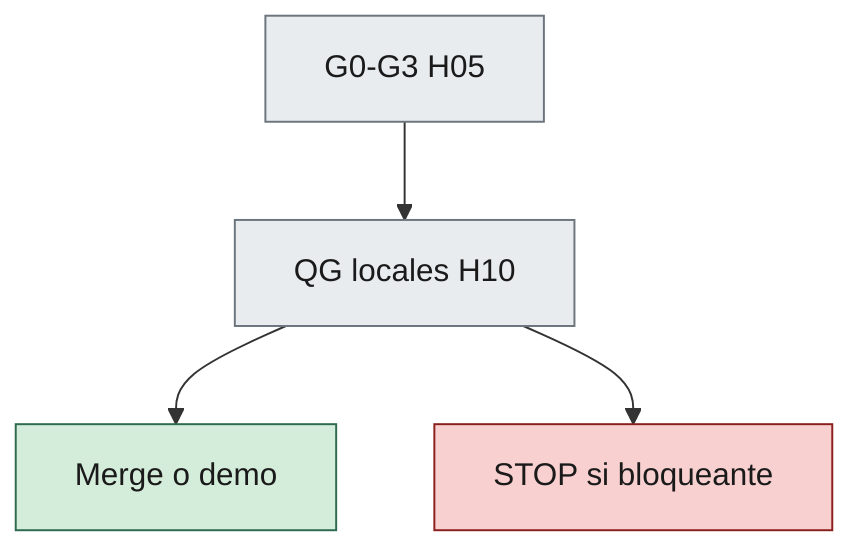

# 10 — Code Review and Quality Gates

| Campo | Valor |
|--------|--------|
| **Versión** | 0.3.0 |
| **Estado** | Approved |
| **Fecha** | 2026-09-19 |
| **Parte** | III — Calidad y entrega |
| **Norma superior** | [05-development-workflow.md](05-development-workflow.md), [02-engineering-principles.md](02-engineering-principles.md), [09-testing-framework.md](09-testing-framework.md), [12-security-standards.md](12-security-standards.md) |
| **Deriva hacia** | Agente Testing+Review, PRs, CI local del consumidor |

---

**En esta página:** [Propósito](#1-propósito) · [Quién revisa](#2-quién-revisa) · [Checklist](#3-checklist-de-code-review) · [Quality gates](#4-quality-gates-técnicos) · [Severidad](#5-severidad-de-hallazgos)

## 1. Propósito

Unificar **code review** y **quality gates** para humanos y agentes: qué se revisa y qué bloquea integrar o declarar demo lista.

Los Gates G0–G3 del [capítulo 05](05-development-workflow.md) siguen vigentes. Este capítulo detalla el checklist de review y los gates técnicos (QG-*).

---

## 2. Quién revisa

| Revisor | Alcance |
|---------|---------|
| Humano | Arquitectura sensible, alcance del MVP del consumidor, Approved |
| Testing+Review | Checklist de este capítulo, tests, regresiones obvias |
| Architecture | Solo si el diff toca boundaries / ADRs |

Ningún agente aprueba enmiendas constitucionales.

---

## 3. Checklist de code review

### 3.1 Gobierno

- [ ] Gate 0 cumplido (specs / ADR si aplica / acceptance / worklog).
- [ ] Sin alcance Out del MVP del consumidor.
- [ ] Worklog actualizado y prompt versionado citado.

### 3.2 Dominio y arquitectura

- [ ] Reglas de negocio no viven solo en UI/API si el ADR de arquitectura del consumidor las sitúa en dominio.
- [ ] Dependencias y límites del ADR de arquitectura respetados.
- [ ] Sin contradicción consciente con specs Approved.

### 3.3 Calidad

- [ ] Tests nuevos o actualizados alineados a acceptance (H09).
- [ ] Nombres alineados al lenguaje de las specs.
- [ ] Sin secretos ni credenciales en claro en el repo (H12).
- [ ] Logging útil sin ruido excesivo y sin secretos.

### 3.4 Coding standards del consumidor (QG-Docs)

Si existe ADR o pack de coding standards, el diff **debe** cumplir ese checklist. El core **no** fija lenguaje, tipado, XML docs ni estilo.

Si no existe ese ADR, QG-Docs es N/A (justificar en worklog).

### 3.5 Producto y runtime

- [ ] Auth / roles no rotos si el diff los toca (H12 + ADR de auth del consumidor).
- [ ] Runbook local sigue siendo válido si cambia la composición (H11).

### 3.6 Seguridad (H12)

Cuando el diff toque auth, sesión, endpoints, secretos o input externo — checklist en [12-security-standards.md](12-security-standards.md) §5.1:

- [ ] Sin secretos nuevos en el diff.
- [ ] Autorización coherente en API (y UI si aplica).
- [ ] Sin injection obvia; alineado al ADR de auth / ACC si aplica.

---

## 4. Quality gates técnicos

| Gate | Condición | Bloquea |
|------|-----------|---------|
| QG-Build | El producto compila / empaqueta según el runbook del consumidor | Merge / demo |
| QG-Unit | Tests unitarios de dominio (+ aplicación relevantes) verdes | Merge / demo |
| QG-Accept | Acceptance del PBI / flujo tocado verdes | Merge a línea de demo |
| QG-Arch | Sin violaciones nuevas de dependencia (manual o test de arquitectura) | Merge si hay infracción nueva |
| QG-Docs | Diff cumple el ADR/pack de coding standards **si existe** | Merge |
| QG-Sec | Diff no introduce secreto en claro ni bypass de auth especificado ([H12](12-security-standards.md)) | Merge |
| QG-Review | Checklist §3 completado | Merge |

CI cloud elaborado es **opcional**. Los gates **deben** poder ejecutarse **en local** (H02 §2.10, H11).

Los comandos concretos los documenta el runbook / pack del consumidor.

---

## 5. Severidad de hallazgos

| Severidad | Acción |
|-----------|--------|
| Bloqueante | No merge |
| Mayor | Corregir o ADR de excepción fechado |
| Menor | Puede ir a deuda registrada en worklog / backlog |

Hallazgos QG-Sec / H12 (secreto en claro, bypass de auth especificado) son **bloqueantes**.

Hallazgos del ADR de coding standards del consumidor, si ese ADR los declara bloqueantes, se tratan como bloqueantes en el diff.

---

## Relacionado

| Destino | Por qué |
|---------|---------|
| [05-development-workflow.md](05-development-workflow.md) | G0–G3; este capítulo detalla QG |
| [09-testing-framework.md](09-testing-framework.md) | QG-Unit / QG-Accept |
| [12-security-standards.md](12-security-standards.md) | QG-Sec y checklist §3.6 |
| [skills/testing-review-pr](../skills/testing-review-pr/SKILL.md) | Playbook de Gate 2 |

## 6. Historial

| Versión | Fecha | Cambio |
|---------|--------|--------|
| 0.3.0 | 2026-09-19 | Approved (aprobación humana del director técnico) |
| 0.3.0 | 2026-09-18 | Draft: trasplante genérico del extract H17; coding standards fuera del core |
