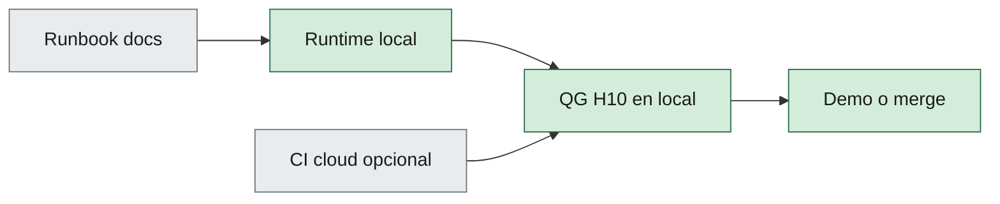

# 11 — DevOps

| Campo | Valor |
|--------|--------|
| **Versión** | 0.3.0 |
| **Estado** | Draft |
| **Fecha** | 2026-09-18 |
| **Parte** | III — Calidad y entrega |
| **Norma superior** | [02-engineering-principles.md](02-engineering-principles.md), [03-repository-organization.md](03-repository-organization.md), [05-development-workflow.md](05-development-workflow.md) |
| **Deriva hacia** | Runbooks en `docs/` del consumidor, `.github/`, skill `devops-ci-gate` |

---

**En esta página:** [Propósito](#1-propósito) · [Objetivos](#2-objetivos-del-método) · [Runtime local](#3-runtime-local) · [Runbook](#4-runbook-obligatorio) · [Entornos](#5-entornos) · [CI](#6-ci-cloud)

> [!NOTE]
> 📝 Capítulo **Draft** (trasplante 0.3.0). Orienta el trabajo; no es norma Approved hasta revisión humana.

## 1. Propósito

Definir DevOps del **método**: prioridad al **runtime local autocontenido**. Cloud no es el camino canónico de demo ni de quality gate.

Alinea H02 §2.10 (Automation First, local). El pack de stack puede aportar orquestación concreta; este capítulo no la nombra como norma.

---

## 2. Objetivos del método

1. Un evaluador levanta la aplicación y sus dependencias en local con el runbook del consumidor.
2. Tests automatizados ejecutables en local (QG de [H10](10-code-review-and-quality-gates.md)).
3. Observabilidad mínima suficiente para diagnosticar arranque y fallos (sin secretos en logs).
4. Secretos fuera de git (H12).

---

## 3. Runtime local

El **cómo** (contenedores, orquestador, perfil HTTPS) lo decide el ADR / pack del consumidor. El método exige que exista un camino local documentado y repetible.

> [!CAUTION]
> “Ya está en cloud, pruébalo ahí” como único camino viola este capítulo y H02 §3.

---

## 4. Runbook (obligatorio)

Debe vivir en el repo consumidor (`docs/` o README) y cubrir:

1. Prerrequisitos (SDK, runtime, Docker u equivalente que el ADR fije).
2. Clonado y restauración de dependencias.
3. Comando de arranque.
4. URLs, usuario de demo si aplica, cómo parar y resetear datos.
5. Troubleshooting corto (puerto ocupado, dependencia que no arranca).

Gate 2 (G2.5, H05) exige que el runtime local siga arrancando según este runbook cuando el diff lo toca.

---

## 5. Entornos

| Entorno | Método |
|---------|--------|
| Local desarrollador / evaluador | **Sí — canónico** |
| CI cloud | Opcional; no sustituye local |
| Staging / prod cloud | Lo fija el MVP del consumidor; **no** es DoD del método |

---

## 6. CI cloud

Añadir pipeline requiere Gate 0 (spec o ADR Approved) igual que cualquier feature. No inventar YAML “de regalo”.

Playbook: [`skills/devops-ci-gate`](../skills/devops-ci-gate/SKILL.md). El agente DevOps del core es **stub** hasta activación humana.

---

## Relacionado

| Destino | Por qué |
|---------|---------|
| [02-engineering-principles.md](02-engineering-principles.md) | Automation First, local |
| [05-development-workflow.md](05-development-workflow.md) | G2.5 runbook |
| [10-code-review-and-quality-gates.md](10-code-review-and-quality-gates.md) | QG ejecutables en local |
| [12-security-standards.md](12-security-standards.md) | Secretos fuera de git |
| [skills/devops-ci-gate](../skills/devops-ci-gate/SKILL.md) | Playbook stub-aware |

## 7. Historial

| Versión | Fecha | Cambio |
|---------|--------|--------|
| 0.3.0 | 2026-09-18 | Draft: trasplante genérico del extract H18; orquestación concreta fuera del core |
