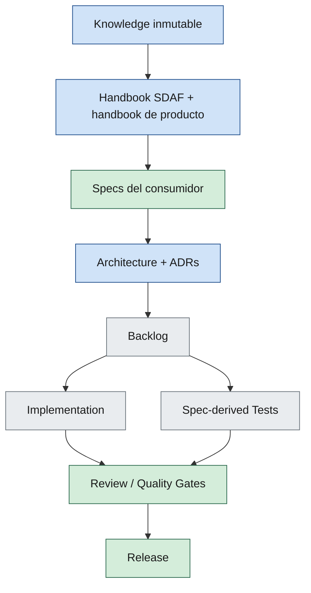

# SDAF — Handbook del método

| Campo | Valor |
|--------|--------|
| Versión | 0.3.3 |
| Estado | Approved |
| Idioma | Español |
| Clasificación | Constitución del método (no del producto) |
| Última actualización | 2026-09-19 |

---

**En esta página:** [Propósito](#propósito) · [Mapa normativo](#mapa-normativo-consumidor) · [Índice](#índice) · [Estados](#estados-de-capítulo) · [Prioridad](#prioridad-ante-conflicto-en-un-repo-consumidor) · [Relacionado](#relacionado)

## Propósito

Este handbook es la **constitución del Spec-Driven AI Development Framework (SDAF)**.

- Define cómo se decide y qué es obligatorio en cualquier proyecto que adopte SDAF.
- Toda spec, ADR, backlog, prompt, worklog e implementación del **consumidor** debe poder justificarse remontándose a este handbook (método) más el handbook de producto del consumidor.
- Si un artefacto del consumidor lo contradice, prevalece este handbook hasta enmienda Approved aquí.

No es un tutorial ni un dump de requisitos de un producto.

El **handbook de producto** (charter, vision, MVP, arquitectura de solución) vive en el repo consumidor y **no** forma parte de este core.

Los HOWTO de adopción, upgrade y contrato de pack viven en [`docs/`](../docs/README.md) de este core (no sustituyen este handbook).

> [!NOTE]
> Este handbook es constitución. Los procedimientos de pin y bootstrap están en [docs/](../docs/README.md).

## Mapa normativo (consumidor)

Las specs en `specs/` del consumidor son la **verdad operativa** para implementar.

Los **agentes IA** no son un nivel normativo: ejecutan el pipeline bajo estas reglas.
Los **prompts**, **skills** y **worklogs** son infraestructura de ingeniería, no sustituyen al handbook.

---

## Índice

### Front matter

| Cap. | Archivo | Título | Estado |
|------|---------|--------|--------|
| 00 | [00-preface.md](00-preface.md) | Preface | ✅ Approved |

### Parte I — Método SDAF

| Cap. | Archivo | Título | Estado |
|------|---------|--------|--------|
| 01 | [01-sdaf-framework.md](01-sdaf-framework.md) | SDAF Framework | ✅ Approved |
| 02 | [02-engineering-principles.md](02-engineering-principles.md) | Engineering Principles | ✅ Approved |
| 03 | [03-repository-organization.md](03-repository-organization.md) | Repository Organization | ✅ Approved |
| 04 | [04-specification-standard.md](04-specification-standard.md) | Specification Standard | ✅ Approved |
| 05 | [05-development-workflow.md](05-development-workflow.md) | Development Workflow | ✅ Approved |

### Parte II — Ingeniería IA

| Cap. | Archivo | Título | Estado |
|------|---------|--------|--------|
| 06 | [06-ai-agent-framework.md](06-ai-agent-framework.md) | AI Agent Framework | ✅ Approved |
| 07 | [07-prompt-engineering-standard.md](07-prompt-engineering-standard.md) | Prompt Engineering Standard | ✅ Approved |
| 08 | [08-agent-traceability.md](08-agent-traceability.md) | Agent Traceability Framework | ✅ Approved |

### Parte III — Calidad y entrega

| Cap. | Archivo | Título | Estado |
|------|---------|--------|--------|
| 09 | [09-testing-framework.md](09-testing-framework.md) | Testing Framework | ✅ Approved |
| 10 | [10-code-review-and-quality-gates.md](10-code-review-and-quality-gates.md) | Code Review and Quality Gates | ✅ Approved |
| 11 | [11-devops.md](11-devops.md) | DevOps | ✅ Approved |
| 12 | [12-security-standards.md](12-security-standards.md) | Security Standards | ✅ Approved |

### Apéndices

| Cap. | Archivo | Título | Estado |
|------|---------|--------|--------|
| A | [A-templates.md](A-templates.md) | Templates | ✅ Approved |
| B | [B-glossary.md](B-glossary.md) | Glossary (método) | ✅ Approved |
| — | [CHANGELOG.md](CHANGELOG.md) | Historial de versiones | ✅ Approved |

**Alcance 0.3.0:** Parte III (testing, review/QG, devops, security) y glosario de método **Approved** (aprobación humana del director técnico). Caps. 00–08 y A no se renumeran. Adopción/upgrade y contrato de pack en `docs/`.

**Parche 0.3.1:** H06 §7 — escritura al remoto y commit local solo con petición explícita; excepción del consumidor acotada.

**Parche 0.3.2:** H12 §3 catálogo baseline/overlay/fuera del método; QG-Sec §5.2; QG-Review HITL; origen ATF (H08 §4.3).

**Parche 0.3.3:** H06 §7 — encargo vigente = este turno; el historial de la conversación no autoriza git ni el remoto.

**Fuera de 0.3 (consumidor, packs o releases posteriores):** charter/MVP/arquitectura de solución (consumidor); métricas de sprint detalladas; glosario de dominio; idiomas distintos de `es`.

---

## Estados de capítulo

| Estado | Significado |
|--------|-------------|
| 📝 **Draft** | Borrador; usable como guía, no cerrado |
| ✅ **Approved** | Norma vigente; cambios requieren revisión formal y CHANGELOG |

Ningún agente puede autodeclarar Approved.

---

## Prioridad ante conflicto (en un repo consumidor)

1. Capítulos **Approved** de este handbook (método)
2. Handbook de producto Approved del consumidor
3. ADRs vigentes en `architecture/decisions/`
4. Specs en `specs/`
5. Backlog
6. Implementación / prompts / worklogs

## Relacionado

| Destino | Por qué |
|---------|---------|
| [README del core](../README.md) | Tres puertas: adoptar, constitución, Gate 0 |
| [Adopción y upgrade](../docs/adopcion-y-upgrade.md) | Pin a tag y bootstrap (HOWTO, no constitución) |
| [mapa-navegacion.md](../docs/mapa-navegacion.md) | Ocho tareas y clics |
| [00-preface.md](00-preface.md) | Qué es y qué no es este handbook |
| [09-testing-framework.md](09-testing-framework.md) | Parte III (calidad y entrega) |
